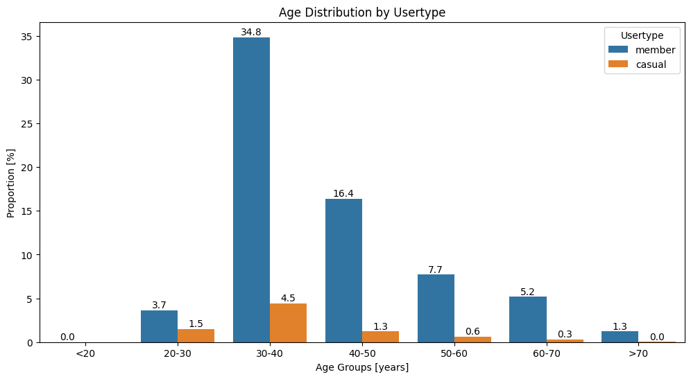
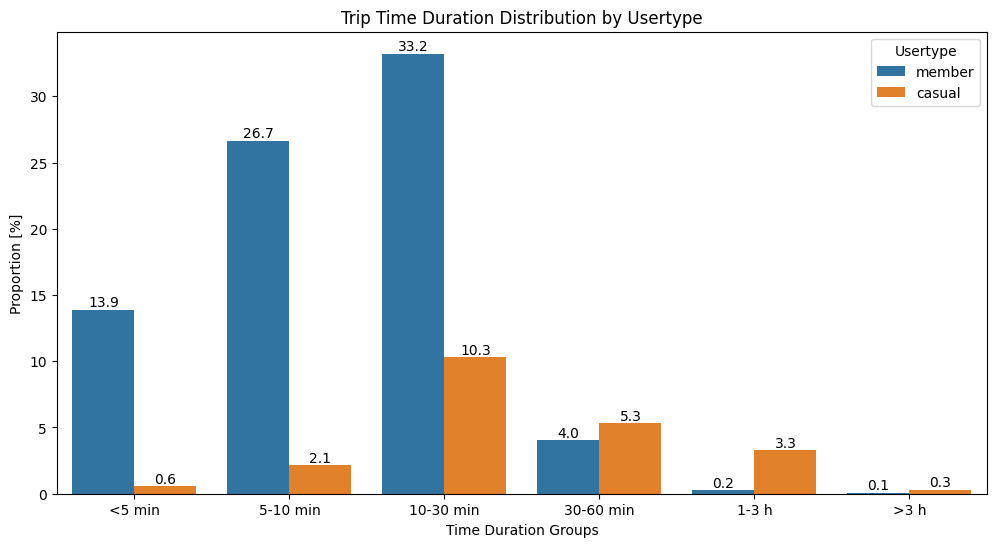
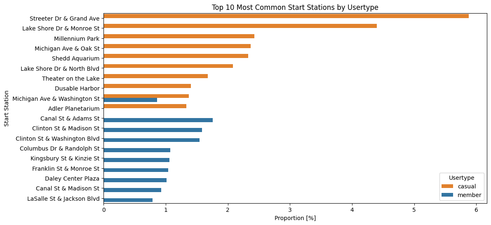

[Back](../README.md)  
<h2 style="text-align:center;">How does a bike-share navigate speedy success.</h2> 

## Exploratory Data Analysis
   

The graph shows a clear distinction between user types, as the majority of members use the service mostly on weekdays, suggesting they are commuting to work. For casual users, there is an increase in usage on weekends, which suggests leisure activity. However, there is also a proportion of casual users on weekdays, which could include tourists or unconverted potential members.

    

The service is used predominantly by male users. When the proportions of member vs. casual users for each gender are calculated, casual users make up 9.7% of the male population and 18% of the female population. This suggests that, although the majority of users are male, there is a higher proportion of unconverted casual users among females.

    

The graph shows age distribution by user type. The largest user group is in the 30–40 year old range, which also contains the highest number of unconverted casual users.

    

The graph shows the distribution of trip lengths by user type. The majority of members’ trips are under 30 minutes. In contrast, casual users tend to take longer trips, peaking in the 10–30 minute range, with some trips lasting up to 3 hours.

    

The graph shows the distribution of trip start times by user type. Member users, previously identified as commuting, show peak usage in the morning and evening, reinforcing the commuting pattern. Casual users predominantly use the service in the afternoon, supporting the idea of leisure-oriented usage.

    

The graph shows the distribution of trips by month for different user types. Casual users show increased usage during the summer months, indicating a potential opportunity for targeted promotions during this period to convert them to members.

    

The graph of the most common start stations by user type shows a clear distinction between casual and member users. This suggests the possibility of promoting specific stations to encourage casual users to convert to membership.

    

Similarly to the start stations, the most common destinations show a clear distinction between user types. Moreover, many popular end stations for casual users are the same as their start stations, further supporting the idea of targeted promotions for these locations.

    

The most popular routes also reveal commonly used paths among casual users.

The map shows the top routes taken by different user types. Casual users primarily operate in the lakeside area, which could be a potential target for promotional efforts.

## Conclusion

The analysis of the data reveals distinct usage patterns between **_member_** and **_casual_** users of the service. **_Member_** usage is concentrated on **weekdays**, with peak hours aligning with typical **commuting** times, indicating that _members_ primarily use the service for work-related travel. In contrast, **_casual_** users show increased activity on weekends and in the afternoons, pointing to a **predominantly leisure-oriented** usage pattern. 

Demographically, the service is **used predominantly by males**; however, a **higher percentage** of **female users remain unconverted** _casual_ users, highlighting a potential area for targeted conversion strategies. Age-wise, the **30–40 year old** demographic constitutes the **largest user segment**, including a **significant proportion** of unconverted **_casual_** users.

Trip duration further differentiates user types, with **_members_** favoring **shorter trips** (under 30 minutes) and **_casual_** users engaging in **longer rides**, often **exceeding 30 minutes**. Seasonal usage trends indicate that **_casual_** user activity rises **during summer** months, suggesting an opportunity for seasonal promotions aimed at conversion.

Spatial data on start and end stations, as well as popular routes, show distinct preferences between user types. **_Casual_ users are heavily concentrated around lakeside areas**, indicating these zones as high-potential targets for marketing and conversion efforts. Promotions focused on **popular _casual_ user stations and routes**, particularly during **peak leisure times and summer months**, could support **increased conversion** to membership.
  [Back](../README.md)