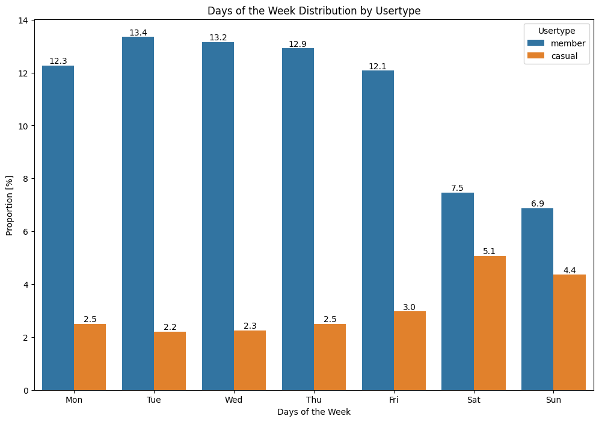
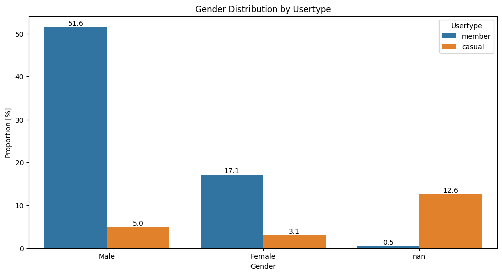
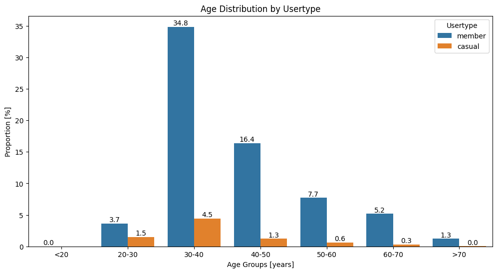
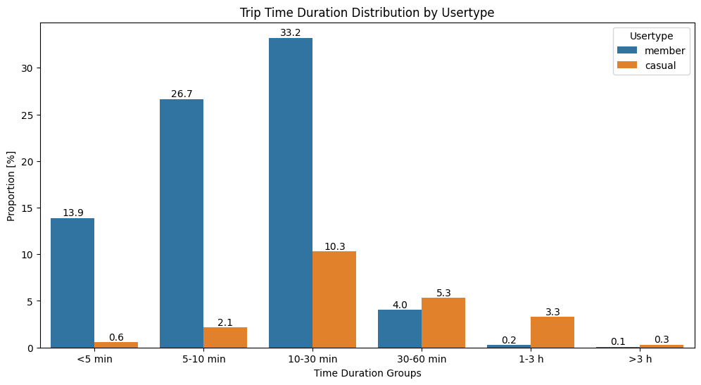
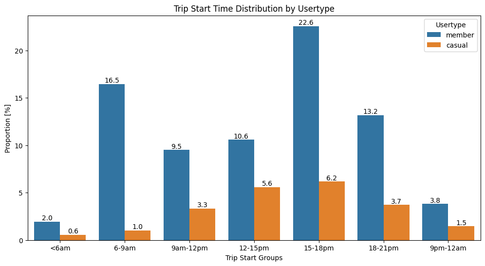
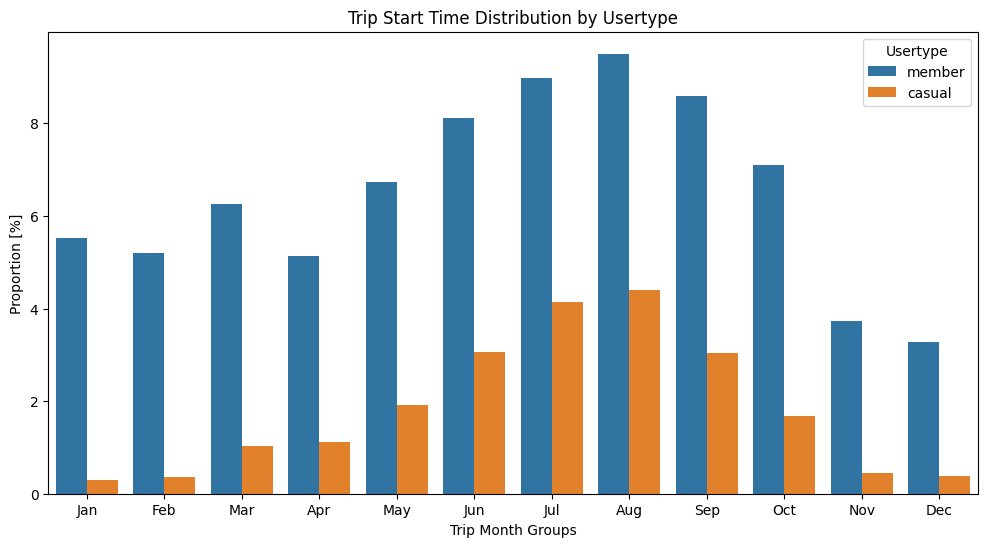
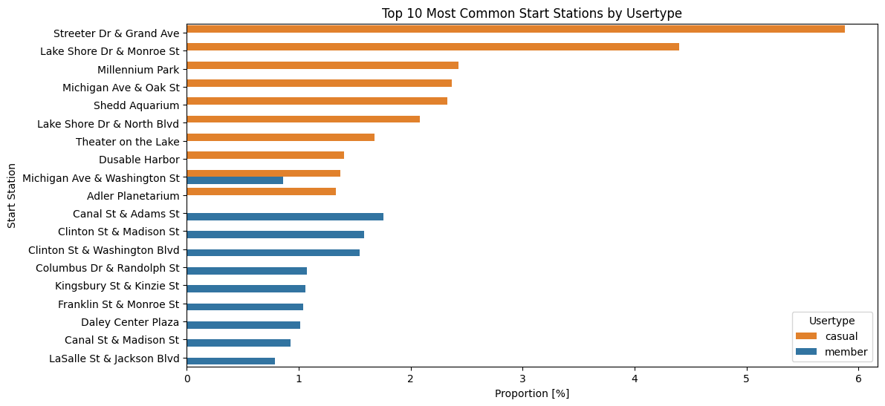
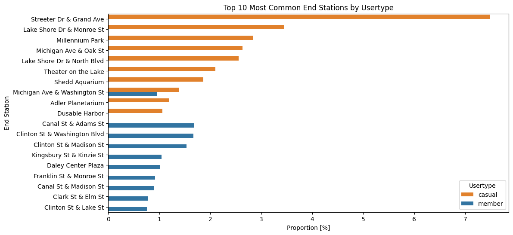
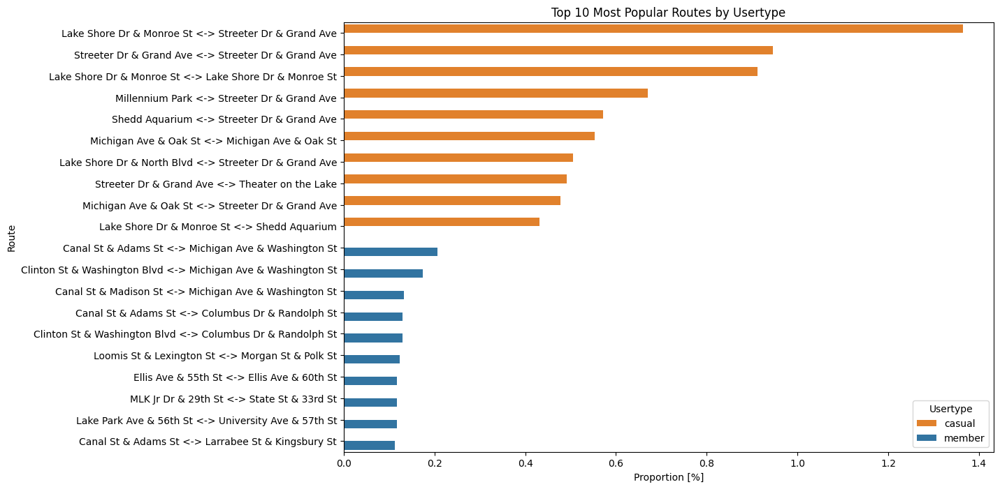
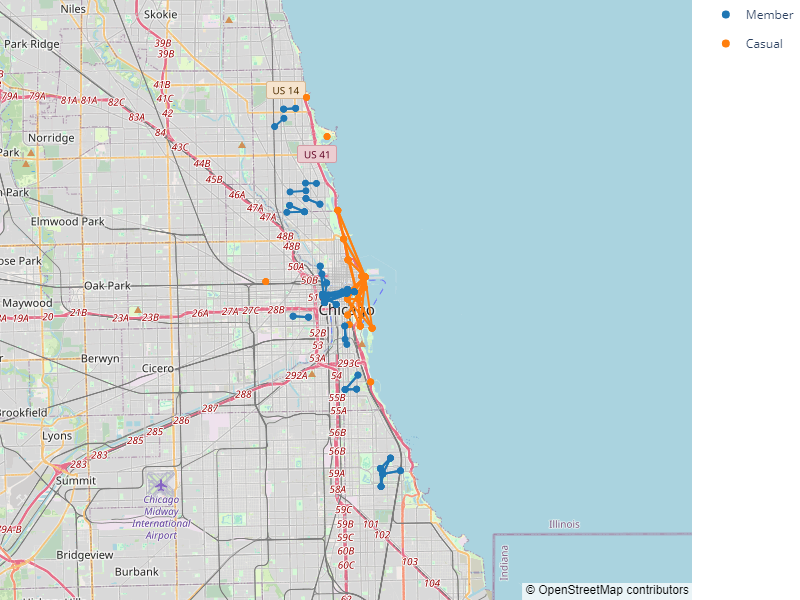

[Back](../README.md)<br><br>
<h2 style="text-align:center;">How does a bike-share navigate speedy success.</h2><br>

## Import Python libraries


```python
import os
import warnings
from math import radians, cos, sin, asin, sqrt

import pandas as pd
import numpy as np
import matplotlib.pyplot as plt
import seaborn as sns
from matplotlib.ticker import FormatStrFormatter
import plotly.graph_objects as go
```

## Define constants


```python
# Constants
MAX_UNIQUE_VALUES = 5
DATA_FOLDER = os.path.join(os.getcwd(), "data")
FILE_2019_Q1 = "Cyclistic_Trips_2019_Q1.csv"
FILE_2019_Q2 = "Cyclistic_Trips_2019_Q2.csv"
FILE_2019_Q3 = "Cyclistic_Trips_2019_Q3.csv"
FILE_2019_Q4 = "Cyclistic_Trips_2019_Q4.csv"
FILE_2020_Q1 = "Cyclistic_Trips_2020_Q1.csv"
DAY_ORDER = ["Monday", "Tuesday", "Wednesday", "Thursday", "Friday", "Saturday", "Sunday"]
CURRENT_YEAR = 2025
```

## Define support functions


```python
def write_unique_values(df, max_unique_values=MAX_UNIQUE_VALUES):
    unique_data = {}
    for column in df.columns:
        unique_num = df[column].nunique(dropna=False)
        if unique_num < max_unique_values:
            unique_data[column] = [df[column].unique().tolist()]
        else:
            unique_data[column] = [f"{unique_num} values"]
    print(pd.DataFrame(unique_data).transpose())
```


```python
def write_data_info(df, name):
    with pd.option_context("display.max_columns", None):
        print(f"{name}:dtypes\n")
        print(df.dtypes, end='')

        print(f"\n\n{name}:describe\n")
        print(df.describe(include="all"), end='')

        print(f"\n\n{name}:head\n")
        print(df.head(10), end='')

        print(f"\n\n{name}:unique_values\n")
        write_unique_values(df)
```


```python
def convert_to_int(df, column_name):
    df[column_name] = df[column_name].astype(str)

    df[column_name] = df[column_name].str.split(".").str[0].str.replace(",", "", regex=False)

    df[column_name] = pd.to_numeric(df[column_name], errors="coerce").astype("Int64")
```


```python
def fix_dtypes(df):
    if "trip_id" in df.columns:
        df["trip_id"] = df["trip_id"].astype(str)
    if "start_time" in df.columns:
        df["start_time"] = pd.to_datetime(df["start_time"])
    if "end_time" in df.columns:
        df["end_time"] = pd.to_datetime(df["end_time"])
    if "tripduration" in df.columns:
        convert_to_int(df, "tripduration")
    if "from_station_id" in df.columns:
        convert_to_int(df, "from_station_id")
    if "from_station_name" in df.columns:
        df["from_station_name"] = df["from_station_name"].astype(str)
    if "to_station_id" in df.columns:
        convert_to_int(df, "to_station_id")
    if "to_station_name" in df.columns:
        df["to_station_name"] = df["to_station_name"].astype(str)
    if "usertype" in df.columns:
        df["usertype"] = df["usertype"].astype(str)
    if "gender" in df.columns:
        df["gender"] = df["gender"].astype(str)
    if "birthyear" in df.columns:
        convert_to_int(df, "birthyear")
    if "bikeid" in df.columns:
        convert_to_int(df, "bikeid")
```


```python
def haversine(lat1, lon1, lat2, lon2):
    R = 6371  # average Earth radius in km
    dlat = radians(lat2 - lat1)
    dlon = radians(lon2 - lon1)
    a = sin(dlat/2)**2 + cos(radians(lat1)) * cos(radians(lat2)) * sin(dlon/2)**2
    return 2 * R * asin(sqrt(a))
```

## Data Loading


```python
df_2019_Q1_raw = pd.read_csv(os.path.join(DATA_FOLDER, FILE_2019_Q1))
pd.set_option('display.expand_frame_repr', False)
write_data_info(df_2019_Q1_raw, FILE_2019_Q1)
```

    Cyclistic_Trips_2019_Q1.csv:dtypes
    
    trip_id                int64
    start_time            object
    end_time              object
    bikeid                 int64
    tripduration          object
    from_station_id        int64
    from_station_name     object
    to_station_id          int64
    to_station_name       object
    usertype              object
    gender                object
    birthyear            float64
    dtype: object
    
    Cyclistic_Trips_2019_Q1.csv:describe
    
                 trip_id           start_time             end_time         bikeid tripduration  from_station_id             from_station_name  to_station_id               to_station_name    usertype  gender      birthyear
    count   3.650690e+05               365069               365069  365069.000000       365069    365069.000000                        365069  365069.000000                        365069      365069  345358  347046.000000
    unique           NaN               343022               338367            NaN         6666              NaN                           594            NaN                           600           2       2            NaN
    top              NaN  2019-03-27 17:27:33  2019-01-04 10:00:09            NaN        279.0              NaN  Clinton St & Washington Blvd            NaN  Clinton St & Washington Blvd  Subscriber    Male            NaN
    freq             NaN                    6                    8            NaN          586              NaN                          7699            NaN                          7699      341906  278440            NaN
    mean    2.196087e+07                  NaN                  NaN    3429.484607          NaN       198.088816                           NaN     198.581123                           NaN         NaN     NaN    1981.674297
    std     1.271750e+05                  NaN                  NaN    1923.321025          NaN       153.493553                           NaN     154.468304                           NaN         NaN     NaN      11.245683
    min     2.174244e+07                  NaN                  NaN       1.000000          NaN         2.000000                           NaN       2.000000                           NaN         NaN     NaN    1900.000000
    25%     2.184876e+07                  NaN                  NaN    1777.000000          NaN        76.000000                           NaN      76.000000                           NaN         NaN     NaN    1975.000000
    50%     2.196183e+07                  NaN                  NaN    3489.000000          NaN       170.000000                           NaN     168.000000                           NaN         NaN     NaN    1985.000000
    75%     2.207182e+07                  NaN                  NaN    5157.000000          NaN       287.000000                           NaN     287.000000                           NaN         NaN     NaN    1990.000000
    max     2.217853e+07                  NaN                  NaN    6471.000000          NaN       665.000000                           NaN     665.000000                           NaN         NaN     NaN    2003.000000
    
    Cyclistic_Trips_2019_Q1.csv:head
    
        trip_id           start_time             end_time  bikeid tripduration  from_station_id                    from_station_name  to_station_id                 to_station_name    usertype  gender  birthyear
    0  21742443  2019-01-01 00:04:37  2019-01-01 00:11:07    2167        390.0              199               Wabash Ave & Grand Ave             84       Milwaukee Ave & Grand Ave  Subscriber    Male     1989.0
    1  21742444  2019-01-01 00:08:13  2019-01-01 00:15:34    4386        441.0               44               State St & Randolph St            624  Dearborn St & Van Buren St (*)  Subscriber  Female     1990.0
    2  21742445  2019-01-01 00:13:23  2019-01-01 00:27:12    1524        829.0               15                 Racine Ave & 18th St            644   Western Ave & Fillmore St (*)  Subscriber  Female     1994.0
    3  21742446  2019-01-01 00:13:45  2019-01-01 00:43:28     252      1,783.0              123       California Ave & Milwaukee Ave            176               Clark St & Elm St  Subscriber    Male     1993.0
    4  21742447  2019-01-01 00:14:52  2019-01-01 00:20:56    1170        364.0              173  Mies van der Rohe Way & Chicago Ave             35         Streeter Dr & Grand Ave  Subscriber    Male     1994.0
    5  21742448  2019-01-01 00:15:33  2019-01-01 00:19:09    2437        216.0               98           LaSalle St & Washington St             49         Dearborn St & Monroe St  Subscriber  Female     1983.0
    6  21742449  2019-01-01 00:16:06  2019-01-01 00:19:03    2708        177.0               98           LaSalle St & Washington St             49         Dearborn St & Monroe St  Subscriber    Male     1984.0
    7  21742450  2019-01-01 00:18:41  2019-01-01 00:20:21    2796        100.0              211               St. Clair St & Erie St            142            McClurg Ct & Erie St  Subscriber    Male     1990.0
    8  21742451  2019-01-01 00:18:43  2019-01-01 00:47:30    6205      1,727.0              150           Fort Dearborn Dr & 31st St            148              State St & 33rd St  Subscriber    Male     1995.0
    9  21742452  2019-01-01 00:19:18  2019-01-01 00:24:54    3939        336.0              268           Lake Shore Dr & North Blvd            141          Clark St & Lincoln Ave  Subscriber    Male     1996.0
    
    Cyclistic_Trips_2019_Q1.csv:unique_values
    
                 trip_id           start_time             end_time         bikeid tripduration  from_station_id             from_station_name  to_station_id               to_station_name    usertype  gender      birthyear
    count   3.650690e+05               365069               365069  365069.000000       365069    365069.000000                        365069  365069.000000                        365069      365069  345358  347046.000000
    unique           NaN               343022               338367            NaN         6666              NaN                           594            NaN                           600           2       2            NaN
    top              NaN  2019-03-27 17:27:33  2019-01-04 10:00:09            NaN        279.0              NaN  Clinton St & Washington Blvd            NaN  Clinton St & Washington Blvd  Subscriber    Male            NaN
    freq             NaN                    6                    8            NaN          586              NaN                          7699            NaN                          7699      341906  278440            NaN
    mean    2.196087e+07                  NaN                  NaN    3429.484607          NaN       198.088816                           NaN     198.581123                           NaN         NaN     NaN    1981.674297
    std     1.271750e+05                  NaN                  NaN    1923.321025          NaN       153.493553                           NaN     154.468304                           NaN         NaN     NaN      11.245683
    min     2.174244e+07                  NaN                  NaN       1.000000          NaN         2.000000                           NaN       2.000000                           NaN         NaN     NaN    1900.000000
    25%     2.184876e+07                  NaN                  NaN    1777.000000          NaN        76.000000                           NaN      76.000000                           NaN         NaN     NaN    1975.000000
    50%     2.196183e+07                  NaN                  NaN    3489.000000          NaN       170.000000                           NaN     168.000000                           NaN         NaN     NaN    1985.000000
    75%     2.207182e+07                  NaN                  NaN    5157.000000          NaN       287.000000                           NaN     287.000000                           NaN         NaN     NaN    1990.000000
    max     2.217853e+07                  NaN                  NaN    6471.000000          NaN       665.000000                           NaN     665.000000                           NaN         NaN     NaN    2003.000000
    
    Cyclistic_Trips_2019_Q1.csv:head
    
        trip_id           start_time             end_time  bikeid tripduration  from_station_id                    from_station_name  to_station_id                 to_station_name    usertype  gender  birthyear
    0  21742443  2019-01-01 00:04:37  2019-01-01 00:11:07    2167        390.0              199               Wabash Ave & Grand Ave             84       Milwaukee Ave & Grand Ave  Subscriber    Male     1989.0
    1  21742444  2019-01-01 00:08:13  2019-01-01 00:15:34    4386        441.0               44               State St & Randolph St            624  Dearborn St & Van Buren St (*)  Subscriber  Female     1990.0
    2  21742445  2019-01-01 00:13:23  2019-01-01 00:27:12    1524        829.0               15                 Racine Ave & 18th St            644   Western Ave & Fillmore St (*)  Subscriber  Female     1994.0
    3  21742446  2019-01-01 00:13:45  2019-01-01 00:43:28     252      1,783.0              123       California Ave & Milwaukee Ave            176               Clark St & Elm St  Subscriber    Male     1993.0
    4  21742447  2019-01-01 00:14:52  2019-01-01 00:20:56    1170        364.0              173  Mies van der Rohe Way & Chicago Ave             35         Streeter Dr & Grand Ave  Subscriber    Male     1994.0
    5  21742448  2019-01-01 00:15:33  2019-01-01 00:19:09    2437        216.0               98           LaSalle St & Washington St             49         Dearborn St & Monroe St  Subscriber  Female     1983.0
    6  21742449  2019-01-01 00:16:06  2019-01-01 00:19:03    2708        177.0               98           LaSalle St & Washington St             49         Dearborn St & Monroe St  Subscriber    Male     1984.0
    7  21742450  2019-01-01 00:18:41  2019-01-01 00:20:21    2796        100.0              211               St. Clair St & Erie St            142            McClurg Ct & Erie St  Subscriber    Male     1990.0
    8  21742451  2019-01-01 00:18:43  2019-01-01 00:47:30    6205      1,727.0              150           Fort Dearborn Dr & 31st St            148              State St & 33rd St  Subscriber    Male     1995.0
    9  21742452  2019-01-01 00:19:18  2019-01-01 00:24:54    3939        336.0              268           Lake Shore Dr & North Blvd            141          Clark St & Lincoln Ave  Subscriber    Male     1996.0
    
    Cyclistic_Trips_2019_Q1.csv:unique_values
    
                                            0
    trip_id                     365069 values
    start_time                  343022 values
    end_time                    338367 values
    bikeid                        4769 values
    tripduration                  6666 values
    from_station_id                594 values
    from_station_name              594 values
    to_station_id                  600 values
    to_station_name                600 values
    usertype           [Subscriber, Customer]
    gender                [Male, Female, nan]
    birthyear                       74 values
                                            0
    trip_id                     365069 values
    start_time                  343022 values
    end_time                    338367 values
    bikeid                        4769 values
    tripduration                  6666 values
    from_station_id                594 values
    from_station_name              594 values
    to_station_id                  600 values
    to_station_name                600 values
    usertype           [Subscriber, Customer]
    gender                [Male, Female, nan]
    birthyear                       74 values
    


```python
df_2019_Q2_raw = pd.read_csv(os.path.join(DATA_FOLDER, FILE_2019_Q2))
pd.set_option('display.expand_frame_repr', False)
write_data_info(df_2019_Q2_raw, FILE_2019_Q2)
```

    Cyclistic_Trips_2019_Q2.csv:dtypes
    
    01 - Rental Details Rental ID                         int64
    01 - Rental Details Local Start Time                 object
    01 - Rental Details Local End Time                   object
    01 - Rental Details Bike ID                           int64
    01 - Rental Details Duration In Seconds Uncapped     object
    03 - Rental Start Station ID                          int64
    03 - Rental Start Station Name                       object
    02 - Rental End Station ID                            int64
    02 - Rental End Station Name                         object
    User Type                                            object
    Member Gender                                        object
    05 - Member Details Member Birthday Year            float64
    dtype: object
    
    Cyclistic_Trips_2019_Q2.csv:describe
    
            01 - Rental Details Rental ID 01 - Rental Details Local Start Time 01 - Rental Details Local End Time  01 - Rental Details Bike ID 01 - Rental Details Duration In Seconds Uncapped  03 - Rental Start Station ID 03 - Rental Start Station Name  02 - Rental End Station ID 02 - Rental End Station Name   User Type Member Gender  05 - Member Details Member Birthday Year
    count                    1.108163e+06                              1108163                            1108163                 1.108163e+06                                          1108163                  1.108163e+06                        1108163                1.108163e+06                      1108163     1108163        922609                             927210.000000
    unique                            NaN                               957330                             922638                          NaN                                            13769                           NaN                            610                         NaN                          612           2             2                                       NaN
    top                               NaN                  2019-06-14 18:03:21                2019-04-17 17:35:12                          NaN                                            376.0                           NaN        Streeter Dr & Grand Ave                         NaN      Streeter Dr & Grand Ave  Subscriber          Male                                       NaN
    freq                              NaN                                    8                                 20                          NaN                                             1139                           NaN                          19414                         NaN                        24852      848577        678568                                       NaN
    mean                     2.282986e+07                                  NaN                                NaN                 3.398800e+03                                              NaN                  2.003032e+02                            NaN                2.012671e+02                          NaN         NaN           NaN                               1983.939102
    std                      3.753977e+05                                  NaN                                NaN                 1.907732e+03                                              NaN                  1.548459e+02                            NaN                1.550123e+02                          NaN         NaN           NaN                                 10.798662
    min                      2.217853e+07                                  NaN                                NaN                 1.000000e+00                                              NaN                  1.000000e+00                            NaN                1.000000e+00                          NaN         NaN           NaN                               1759.000000
    25%                      2.250507e+07                                  NaN                                NaN                 1.738000e+03                                              NaN                  7.700000e+01                            NaN                7.700000e+01                          NaN         NaN           NaN                               1979.000000
    50%                      2.283116e+07                                  NaN                                NaN                 3.471000e+03                                              NaN                  1.740000e+02                            NaN                1.740000e+02                          NaN         NaN           NaN                               1987.000000
    75%                      2.315450e+07                                  NaN                                NaN                 5.080000e+03                                              NaN                  2.890000e+02                            NaN                2.900000e+02                          NaN         NaN           NaN                               1992.000000
    max                      2.347939e+07                                  NaN                                NaN                 6.471000e+03                                              NaN                  6.690000e+02                            NaN                6.690000e+02                          NaN         NaN           NaN                               2014.000000
    
    Cyclistic_Trips_2019_Q2.csv:head
    
       01 - Rental Details Rental ID 01 - Rental Details Local Start Time 01 - Rental Details Local End Time  01 - Rental Details Bike ID 01 - Rental Details Duration In Seconds Uncapped  03 - Rental Start Station ID 03 - Rental Start Station Name  02 - Rental End Station ID     02 - Rental End Station Name   User Type Member Gender  05 - Member Details Member Birthday Year
    0                       22178529                  2019-04-01 00:02:22                2019-04-01 00:09:48                         6251                                            446.0                            81             Daley Center Plaza                          56        Desplaines St & Kinzie St  Subscriber          Male                                    1975.0
    1                       22178530                  2019-04-01 00:03:02                2019-04-01 00:20:30                         6226                                          1,048.0                           317            Wood St & Taylor St                          59        Wabash Ave & Roosevelt Rd  Subscriber        Female                                    1984.0
    2                       22178531                  2019-04-01 00:11:07                2019-04-01 00:15:19                         5649                                            252.0                           283      LaSalle St & Jackson Blvd                         174            Canal St & Madison St  Subscriber          Male                                    1990.0
    3                       22178532                  2019-04-01 00:13:01                2019-04-01 00:18:58                         4151                                            357.0                            26       McClurg Ct & Illinois St                         133         Kingsbury St & Kinzie St  Subscriber          Male                                    1993.0
    4                       22178533                  2019-04-01 00:19:26                2019-04-01 00:36:13                         3270                                          1,007.0                           202           Halsted St & 18th St                         129        Blue Island Ave & 18th St  Subscriber          Male                                    1992.0
    5                       22178534                  2019-04-01 00:19:39                2019-04-01 00:23:56                         3123                                            257.0                           420            Ellis Ave & 55th St                         426              Ellis Ave & 60th St  Subscriber          Male                                    1999.0
    6                       22178535                  2019-04-01 00:26:33                2019-04-01 00:35:41                         6418                                            548.0                           503      Drake Ave & Fullerton Ave                         500  Central Park Ave & Elbridge Ave  Subscriber          Male                                    1969.0
    7                       22178536                  2019-04-01 00:29:48                2019-04-01 00:36:11                         4513                                            383.0                           260     Kedzie Ave & Milwaukee Ave                         499                  Kosciuszko Park  Subscriber          Male                                    1991.0
    8                       22178537                  2019-04-01 00:32:07                2019-04-01 01:07:44                         3280                                          2,137.0                           211         St. Clair St & Erie St                         211           St. Clair St & Erie St    Customer           NaN                                       NaN
    9                       22178538                  2019-04-01 00:32:19                2019-04-01 01:07:39                         5534                                          2,120.0                           211         St. Clair St & Erie St                         211           St. Clair St & Erie St    Customer           NaN                                       NaN
    
    Cyclistic_Trips_2019_Q2.csv:unique_values
    
            01 - Rental Details Rental ID 01 - Rental Details Local Start Time 01 - Rental Details Local End Time  01 - Rental Details Bike ID 01 - Rental Details Duration In Seconds Uncapped  03 - Rental Start Station ID 03 - Rental Start Station Name  02 - Rental End Station ID 02 - Rental End Station Name   User Type Member Gender  05 - Member Details Member Birthday Year
    count                    1.108163e+06                              1108163                            1108163                 1.108163e+06                                          1108163                  1.108163e+06                        1108163                1.108163e+06                      1108163     1108163        922609                             927210.000000
    unique                            NaN                               957330                             922638                          NaN                                            13769                           NaN                            610                         NaN                          612           2             2                                       NaN
    top                               NaN                  2019-06-14 18:03:21                2019-04-17 17:35:12                          NaN                                            376.0                           NaN        Streeter Dr & Grand Ave                         NaN      Streeter Dr & Grand Ave  Subscriber          Male                                       NaN
    freq                              NaN                                    8                                 20                          NaN                                             1139                           NaN                          19414                         NaN                        24852      848577        678568                                       NaN
    mean                     2.282986e+07                                  NaN                                NaN                 3.398800e+03                                              NaN                  2.003032e+02                            NaN                2.012671e+02                          NaN         NaN           NaN                               1983.939102
    std                      3.753977e+05                                  NaN                                NaN                 1.907732e+03                                              NaN                  1.548459e+02                            NaN                1.550123e+02                          NaN         NaN           NaN                                 10.798662
    min                      2.217853e+07                                  NaN                                NaN                 1.000000e+00                                              NaN                  1.000000e+00                            NaN                1.000000e+00                          NaN         NaN           NaN                               1759.000000
    25%                      2.250507e+07                                  NaN                                NaN                 1.738000e+03                                              NaN                  7.700000e+01                            NaN                7.700000e+01                          NaN         NaN           NaN                               1979.000000
    50%                      2.283116e+07                                  NaN                                NaN                 3.471000e+03                                              NaN                  1.740000e+02                            NaN                1.740000e+02                          NaN         NaN           NaN                               1987.000000
    75%                      2.315450e+07                                  NaN                                NaN                 5.080000e+03                                              NaN                  2.890000e+02                            NaN                2.900000e+02                          NaN         NaN           NaN                               1992.000000
    max                      2.347939e+07                                  NaN                                NaN                 6.471000e+03                                              NaN                  6.690000e+02                            NaN                6.690000e+02                          NaN         NaN           NaN                               2014.000000
    
    Cyclistic_Trips_2019_Q2.csv:head
    
       01 - Rental Details Rental ID 01 - Rental Details Local Start Time 01 - Rental Details Local End Time  01 - Rental Details Bike ID 01 - Rental Details Duration In Seconds Uncapped  03 - Rental Start Station ID 03 - Rental Start Station Name  02 - Rental End Station ID     02 - Rental End Station Name   User Type Member Gender  05 - Member Details Member Birthday Year
    0                       22178529                  2019-04-01 00:02:22                2019-04-01 00:09:48                         6251                                            446.0                            81             Daley Center Plaza                          56        Desplaines St & Kinzie St  Subscriber          Male                                    1975.0
    1                       22178530                  2019-04-01 00:03:02                2019-04-01 00:20:30                         6226                                          1,048.0                           317            Wood St & Taylor St                          59        Wabash Ave & Roosevelt Rd  Subscriber        Female                                    1984.0
    2                       22178531                  2019-04-01 00:11:07                2019-04-01 00:15:19                         5649                                            252.0                           283      LaSalle St & Jackson Blvd                         174            Canal St & Madison St  Subscriber          Male                                    1990.0
    3                       22178532                  2019-04-01 00:13:01                2019-04-01 00:18:58                         4151                                            357.0                            26       McClurg Ct & Illinois St                         133         Kingsbury St & Kinzie St  Subscriber          Male                                    1993.0
    4                       22178533                  2019-04-01 00:19:26                2019-04-01 00:36:13                         3270                                          1,007.0                           202           Halsted St & 18th St                         129        Blue Island Ave & 18th St  Subscriber          Male                                    1992.0
    5                       22178534                  2019-04-01 00:19:39                2019-04-01 00:23:56                         3123                                            257.0                           420            Ellis Ave & 55th St                         426              Ellis Ave & 60th St  Subscriber          Male                                    1999.0
    6                       22178535                  2019-04-01 00:26:33                2019-04-01 00:35:41                         6418                                            548.0                           503      Drake Ave & Fullerton Ave                         500  Central Park Ave & Elbridge Ave  Subscriber          Male                                    1969.0
    7                       22178536                  2019-04-01 00:29:48                2019-04-01 00:36:11                         4513                                            383.0                           260     Kedzie Ave & Milwaukee Ave                         499                  Kosciuszko Park  Subscriber          Male                                    1991.0
    8                       22178537                  2019-04-01 00:32:07                2019-04-01 01:07:44                         3280                                          2,137.0                           211         St. Clair St & Erie St                         211           St. Clair St & Erie St    Customer           NaN                                       NaN
    9                       22178538                  2019-04-01 00:32:19                2019-04-01 01:07:39                         5534                                          2,120.0                           211         St. Clair St & Erie St                         211           St. Clair St & Erie St    Customer           NaN                                       NaN
    
    Cyclistic_Trips_2019_Q2.csv:unique_values
    
                                                                           0
    01 - Rental Details Rental ID                             1108163 values
    01 - Rental Details Local Start Time                       957330 values
    01 - Rental Details Local End Time                         922638 values
    01 - Rental Details Bike ID                                  5764 values
    01 - Rental Details Duration In Seconds Uncapped            13769 values
    03 - Rental Start Station ID                                  610 values
    03 - Rental Start Station Name                                610 values
    02 - Rental End Station ID                                    612 values
    02 - Rental End Station Name                                  612 values
    User Type                                         [Subscriber, Customer]
    Member Gender                                        [Male, Female, nan]
    05 - Member Details Member Birthday Year                       85 values
                                                                           0
    01 - Rental Details Rental ID                             1108163 values
    01 - Rental Details Local Start Time                       957330 values
    01 - Rental Details Local End Time                         922638 values
    01 - Rental Details Bike ID                                  5764 values
    01 - Rental Details Duration In Seconds Uncapped            13769 values
    03 - Rental Start Station ID                                  610 values
    03 - Rental Start Station Name                                610 values
    02 - Rental End Station ID                                    612 values
    02 - Rental End Station Name                                  612 values
    User Type                                         [Subscriber, Customer]
    Member Gender                                        [Male, Female, nan]
    05 - Member Details Member Birthday Year                       85 values
    


```python
df_2019_Q3_raw = pd.read_csv(os.path.join(DATA_FOLDER, FILE_2019_Q3))
pd.set_option('display.expand_frame_repr', False)
write_data_info(df_2019_Q3_raw, FILE_2019_Q3)
```

    Cyclistic_Trips_2019_Q3.csv:dtypes
    
    trip_id                int64
    start_time            object
    end_time              object
    bikeid                 int64
    tripduration          object
    from_station_id        int64
    from_station_name     object
    to_station_id          int64
    to_station_name       object
    usertype              object
    gender                object
    birthyear            float64
    dtype: object
    
    Cyclistic_Trips_2019_Q3.csv:describe
    
                 trip_id           start_time             end_time        bikeid tripduration  from_station_id        from_station_name  to_station_id          to_station_name    usertype   gender     birthyear
    count   1.640718e+06              1640718              1640718  1.640718e+06      1640718     1.640718e+06                  1640718   1.640718e+06                  1640718     1640718  1353368  1.362624e+06
    unique           NaN              1372358              1344539           NaN        16676              NaN                      612            NaN                      613           2        2           NaN
    top              NaN  2019-08-29 17:22:03  2019-07-14 16:20:26           NaN        381.0              NaN  Streeter Dr & Grand Ave            NaN  Streeter Dr & Grand Ave  Subscriber     Male           NaN
    freq             NaN                    7                   19           NaN         1545              NaN                    39726            NaN                    45391     1149024   957353           NaN
    mean    2.436447e+07                  NaN                  NaN  3.349856e+03          NaN     2.023980e+02                      NaN   2.039011e+02                      NaN         NaN      NaN  1.984903e+03
    std     4.995484e+05                  NaN                  NaN  1.888878e+03          NaN     1.567226e+02                      NaN   1.566986e+02                      NaN         NaN      NaN  1.060596e+01
    min     2.347939e+07                  NaN                  NaN  1.000000e+00          NaN     2.000000e+00                      NaN   2.000000e+00                      NaN         NaN      NaN  1.888000e+03
    25%     2.393550e+07                  NaN                  NaN  1.713000e+03          NaN     7.700000e+01                      NaN   8.000000e+01                      NaN         NaN      NaN  1.980000e+03
    50%     2.436742e+07                  NaN                  NaN  3.419000e+03          NaN     1.740000e+02                      NaN   1.760000e+02                      NaN         NaN      NaN  1.988000e+03
    75%     2.479740e+07                  NaN                  NaN  4.997000e+03          NaN     2.890000e+02                      NaN   2.910000e+02                      NaN         NaN      NaN  1.992000e+03
    max     2.522364e+07                  NaN                  NaN  6.471000e+03          NaN     6.730000e+02                      NaN   6.730000e+02                      NaN         NaN      NaN  2.003000e+03
    
    Cyclistic_Trips_2019_Q3.csv:head
    
        trip_id           start_time             end_time  bikeid tripduration  from_station_id              from_station_name  to_station_id                to_station_name    usertype gender  birthyear
    0  23479388  2019-07-01 00:00:27  2019-07-01 00:20:41    3591      1,214.0              117       Wilton Ave & Belmont Ave            497      Kimball Ave & Belmont Ave  Subscriber   Male     1992.0
    1  23479389  2019-07-01 00:01:16  2019-07-01 00:18:44    5353      1,048.0              381        Western Ave & Monroe St            203          Western Ave & 21st St    Customer    NaN        NaN
    2  23479390  2019-07-01 00:01:48  2019-07-01 00:27:42    6180      1,554.0              313  Lakeview Ave & Fullerton Pkwy            144      Larrabee St & Webster Ave    Customer    NaN        NaN
    3  23479391  2019-07-01 00:02:07  2019-07-01 00:27:10    5540      1,503.0              313  Lakeview Ave & Fullerton Pkwy            144      Larrabee St & Webster Ave    Customer    NaN        NaN
    4  23479392  2019-07-01 00:02:13  2019-07-01 00:22:26    6014      1,213.0              168         Michigan Ave & 14th St             62                McCormick Place    Customer    NaN        NaN
    5  23479393  2019-07-01 00:02:21  2019-07-01 00:07:31    4941        310.0              300           Broadway & Barry Ave            232  Pine Grove Ave & Waveland Ave  Subscriber   Male     1990.0
    6  23479394  2019-07-01 00:02:24  2019-07-01 00:23:12    3770      1,248.0              168         Michigan Ave & 14th St             62                McCormick Place    Customer    NaN        NaN
    7  23479395  2019-07-01 00:02:26  2019-07-01 00:28:16    5442      1,550.0              313  Lakeview Ave & Fullerton Pkwy            144      Larrabee St & Webster Ave    Customer    NaN        NaN
    8  23479396  2019-07-01 00:02:34  2019-07-01 00:28:57    2957      1,583.0               43   Michigan Ave & Washington St            195      Columbus Dr & Randolph St    Customer    NaN        NaN
    9  23479397  2019-07-01 00:02:45  2019-07-01 00:29:14    6091      1,589.0               43   Michigan Ave & Washington St            195      Columbus Dr & Randolph St    Customer    NaN        NaN
    
    Cyclistic_Trips_2019_Q3.csv:unique_values
    
                 trip_id           start_time             end_time        bikeid tripduration  from_station_id        from_station_name  to_station_id          to_station_name    usertype   gender     birthyear
    count   1.640718e+06              1640718              1640718  1.640718e+06      1640718     1.640718e+06                  1640718   1.640718e+06                  1640718     1640718  1353368  1.362624e+06
    unique           NaN              1372358              1344539           NaN        16676              NaN                      612            NaN                      613           2        2           NaN
    top              NaN  2019-08-29 17:22:03  2019-07-14 16:20:26           NaN        381.0              NaN  Streeter Dr & Grand Ave            NaN  Streeter Dr & Grand Ave  Subscriber     Male           NaN
    freq             NaN                    7                   19           NaN         1545              NaN                    39726            NaN                    45391     1149024   957353           NaN
    mean    2.436447e+07                  NaN                  NaN  3.349856e+03          NaN     2.023980e+02                      NaN   2.039011e+02                      NaN         NaN      NaN  1.984903e+03
    std     4.995484e+05                  NaN                  NaN  1.888878e+03          NaN     1.567226e+02                      NaN   1.566986e+02                      NaN         NaN      NaN  1.060596e+01
    min     2.347939e+07                  NaN                  NaN  1.000000e+00          NaN     2.000000e+00                      NaN   2.000000e+00                      NaN         NaN      NaN  1.888000e+03
    25%     2.393550e+07                  NaN                  NaN  1.713000e+03          NaN     7.700000e+01                      NaN   8.000000e+01                      NaN         NaN      NaN  1.980000e+03
    50%     2.436742e+07                  NaN                  NaN  3.419000e+03          NaN     1.740000e+02                      NaN   1.760000e+02                      NaN         NaN      NaN  1.988000e+03
    75%     2.479740e+07                  NaN                  NaN  4.997000e+03          NaN     2.890000e+02                      NaN   2.910000e+02                      NaN         NaN      NaN  1.992000e+03
    max     2.522364e+07                  NaN                  NaN  6.471000e+03          NaN     6.730000e+02                      NaN   6.730000e+02                      NaN         NaN      NaN  2.003000e+03
    
    Cyclistic_Trips_2019_Q3.csv:head
    
        trip_id           start_time             end_time  bikeid tripduration  from_station_id              from_station_name  to_station_id                to_station_name    usertype gender  birthyear
    0  23479388  2019-07-01 00:00:27  2019-07-01 00:20:41    3591      1,214.0              117       Wilton Ave & Belmont Ave            497      Kimball Ave & Belmont Ave  Subscriber   Male     1992.0
    1  23479389  2019-07-01 00:01:16  2019-07-01 00:18:44    5353      1,048.0              381        Western Ave & Monroe St            203          Western Ave & 21st St    Customer    NaN        NaN
    2  23479390  2019-07-01 00:01:48  2019-07-01 00:27:42    6180      1,554.0              313  Lakeview Ave & Fullerton Pkwy            144      Larrabee St & Webster Ave    Customer    NaN        NaN
    3  23479391  2019-07-01 00:02:07  2019-07-01 00:27:10    5540      1,503.0              313  Lakeview Ave & Fullerton Pkwy            144      Larrabee St & Webster Ave    Customer    NaN        NaN
    4  23479392  2019-07-01 00:02:13  2019-07-01 00:22:26    6014      1,213.0              168         Michigan Ave & 14th St             62                McCormick Place    Customer    NaN        NaN
    5  23479393  2019-07-01 00:02:21  2019-07-01 00:07:31    4941        310.0              300           Broadway & Barry Ave            232  Pine Grove Ave & Waveland Ave  Subscriber   Male     1990.0
    6  23479394  2019-07-01 00:02:24  2019-07-01 00:23:12    3770      1,248.0              168         Michigan Ave & 14th St             62                McCormick Place    Customer    NaN        NaN
    7  23479395  2019-07-01 00:02:26  2019-07-01 00:28:16    5442      1,550.0              313  Lakeview Ave & Fullerton Pkwy            144      Larrabee St & Webster Ave    Customer    NaN        NaN
    8  23479396  2019-07-01 00:02:34  2019-07-01 00:28:57    2957      1,583.0               43   Michigan Ave & Washington St            195      Columbus Dr & Randolph St    Customer    NaN        NaN
    9  23479397  2019-07-01 00:02:45  2019-07-01 00:29:14    6091      1,589.0               43   Michigan Ave & Washington St            195      Columbus Dr & Randolph St    Customer    NaN        NaN
    
    Cyclistic_Trips_2019_Q3.csv:unique_values
    
                                            0
    trip_id                    1640718 values
    start_time                 1372358 values
    end_time                   1344539 values
    bikeid                        5787 values
    tripduration                 16676 values
    from_station_id                612 values
    from_station_name              612 values
    to_station_id                  613 values
    to_station_name                613 values
    usertype           [Subscriber, Customer]
    gender                [Male, nan, Female]
    birthyear                       87 values
                                            0
    trip_id                    1640718 values
    start_time                 1372358 values
    end_time                   1344539 values
    bikeid                        5787 values
    tripduration                 16676 values
    from_station_id                612 values
    from_station_name              612 values
    to_station_id                  613 values
    to_station_name                613 values
    usertype           [Subscriber, Customer]
    gender                [Male, nan, Female]
    birthyear                       87 values
    


```python
df_2019_Q4_raw= pd.read_csv(os.path.join(DATA_FOLDER, FILE_2019_Q4))
pd.set_option('display.expand_frame_repr', False)
write_data_info(df_2019_Q4_raw, FILE_2019_Q4)
```

    Cyclistic_Trips_2019_Q4.csv:dtypes
    
    trip_id                int64
    start_time            object
    end_time              object
    bikeid                 int64
    tripduration          object
    from_station_id        int64
    from_station_name     object
    to_station_id          int64
    to_station_name       object
    usertype              object
    gender                object
    birthyear            float64
    dtype: object
    
    Cyclistic_Trips_2019_Q4.csv:describe
    
                 trip_id           start_time             end_time         bikeid tripduration  from_station_id    from_station_name  to_station_id      to_station_name    usertype  gender      birthyear
    count   7.040540e+05               704054               704054  704054.000000       704054    704054.000000               704054  704054.000000               704054      704054  637463  642373.000000
    unique           NaN               633380               632834            NaN        10401              NaN                  610            NaN                  608           2       2            NaN
    top              NaN  2019-10-01 17:18:33  2019-10-07 17:54:43            NaN        352.0              NaN  Canal St & Adams St            NaN  Canal St & Adams St  Subscriber    Male            NaN
    freq             NaN                    7                    6            NaN          975              NaN                12937            NaN                12812      597860  486459            NaN
    mean    2.559222e+07                  NaN                  NaN    3396.362711          NaN       203.959479                  NaN     203.946606                  NaN         NaN     NaN    1983.808776
    std     2.135697e+05                  NaN                  NaN    1913.953377          NaN       157.782842                  NaN     157.938449                  NaN         NaN     NaN      11.097284
    min     2.522364e+07                  NaN                  NaN       1.000000          NaN         2.000000                  NaN       2.000000                  NaN         NaN     NaN    1899.000000
    25%     2.540738e+07                  NaN                  NaN    1724.000000          NaN        77.000000                  NaN      77.000000                  NaN         NaN     NaN    1978.000000
    50%     2.559086e+07                  NaN                  NaN    3473.000000          NaN       174.000000                  NaN     174.000000                  NaN         NaN     NaN    1987.000000
    75%     2.577717e+07                  NaN                  NaN    5065.000000          NaN       291.000000                  NaN     291.000000                  NaN         NaN     NaN    1992.000000
    max     2.596290e+07                  NaN                  NaN    6946.000000          NaN       673.000000                  NaN     673.000000                  NaN         NaN     NaN    2003.000000
    
    Cyclistic_Trips_2019_Q4.csv:head
    
        trip_id           start_time             end_time  bikeid tripduration  from_station_id               from_station_name  to_station_id              to_station_name    usertype  gender  birthyear
    0  25223640  2019-10-01 00:01:39  2019-10-01 00:17:20    2215        940.0               20    Sheffield Ave & Kingsbury St            309    Leavitt St & Armitage Ave  Subscriber    Male     1987.0
    1  25223641  2019-10-01 00:02:16  2019-10-01 00:06:34    6328        258.0               19  Throop (Loomis) St & Taylor St            241          Morgan St & Polk St  Subscriber    Male     1998.0
    2  25223642  2019-10-01 00:04:32  2019-10-01 00:18:43    3003        850.0               84       Milwaukee Ave & Grand Ave            199       Wabash Ave & Grand Ave  Subscriber  Female     1991.0
    3  25223643  2019-10-01 00:04:32  2019-10-01 00:43:43    3275      2,350.0              313   Lakeview Ave & Fullerton Pkwy            290       Kedzie Ave & Palmer Ct  Subscriber    Male     1990.0
    4  25223644  2019-10-01 00:04:34  2019-10-01 00:35:42    5294      1,867.0              210       Ashland Ave & Division St            382  Western Ave & Congress Pkwy  Subscriber    Male     1987.0
    5  25223645  2019-10-01 00:04:38  2019-10-01 00:10:51    1891        373.0              156       Clark St & Wellington Ave            226     Racine Ave & Belmont Ave  Subscriber  Female     1994.0
    6  25223646  2019-10-01 00:04:52  2019-10-01 00:22:45    1061      1,072.0               84       Milwaukee Ave & Grand Ave            142         McClurg Ct & Erie St  Subscriber  Female     1991.0
    7  25223647  2019-10-01 00:04:57  2019-10-01 00:29:16    1274      1,458.0              156       Clark St & Wellington Ave            463        Clark St & Berwyn Ave  Subscriber    Male     1995.0
    8  25223648  2019-10-01 00:05:20  2019-10-01 00:29:18    6011      1,437.0              156       Clark St & Wellington Ave            463        Clark St & Berwyn Ave  Subscriber  Female     1993.0
    9  25223649  2019-10-01 00:05:20  2019-10-01 02:23:46    2957      8,306.0              336     Cottage Grove Ave & 47th St            336  Cottage Grove Ave & 47th St    Customer     NaN        NaN
    
    Cyclistic_Trips_2019_Q4.csv:unique_values
    
                 trip_id           start_time             end_time         bikeid tripduration  from_station_id    from_station_name  to_station_id      to_station_name    usertype  gender      birthyear
    count   7.040540e+05               704054               704054  704054.000000       704054    704054.000000               704054  704054.000000               704054      704054  637463  642373.000000
    unique           NaN               633380               632834            NaN        10401              NaN                  610            NaN                  608           2       2            NaN
    top              NaN  2019-10-01 17:18:33  2019-10-07 17:54:43            NaN        352.0              NaN  Canal St & Adams St            NaN  Canal St & Adams St  Subscriber    Male            NaN
    freq             NaN                    7                    6            NaN          975              NaN                12937            NaN                12812      597860  486459            NaN
    mean    2.559222e+07                  NaN                  NaN    3396.362711          NaN       203.959479                  NaN     203.946606                  NaN         NaN     NaN    1983.808776
    std     2.135697e+05                  NaN                  NaN    1913.953377          NaN       157.782842                  NaN     157.938449                  NaN         NaN     NaN      11.097284
    min     2.522364e+07                  NaN                  NaN       1.000000          NaN         2.000000                  NaN       2.000000                  NaN         NaN     NaN    1899.000000
    25%     2.540738e+07                  NaN                  NaN    1724.000000          NaN        77.000000                  NaN      77.000000                  NaN         NaN     NaN    1978.000000
    50%     2.559086e+07                  NaN                  NaN    3473.000000          NaN       174.000000                  NaN     174.000000                  NaN         NaN     NaN    1987.000000
    75%     2.577717e+07                  NaN                  NaN    5065.000000          NaN       291.000000                  NaN     291.000000                  NaN         NaN     NaN    1992.000000
    max     2.596290e+07                  NaN                  NaN    6946.000000          NaN       673.000000                  NaN     673.000000                  NaN         NaN     NaN    2003.000000
    
    Cyclistic_Trips_2019_Q4.csv:head
    
        trip_id           start_time             end_time  bikeid tripduration  from_station_id               from_station_name  to_station_id              to_station_name    usertype  gender  birthyear
    0  25223640  2019-10-01 00:01:39  2019-10-01 00:17:20    2215        940.0               20    Sheffield Ave & Kingsbury St            309    Leavitt St & Armitage Ave  Subscriber    Male     1987.0
    1  25223641  2019-10-01 00:02:16  2019-10-01 00:06:34    6328        258.0               19  Throop (Loomis) St & Taylor St            241          Morgan St & Polk St  Subscriber    Male     1998.0
    2  25223642  2019-10-01 00:04:32  2019-10-01 00:18:43    3003        850.0               84       Milwaukee Ave & Grand Ave            199       Wabash Ave & Grand Ave  Subscriber  Female     1991.0
    3  25223643  2019-10-01 00:04:32  2019-10-01 00:43:43    3275      2,350.0              313   Lakeview Ave & Fullerton Pkwy            290       Kedzie Ave & Palmer Ct  Subscriber    Male     1990.0
    4  25223644  2019-10-01 00:04:34  2019-10-01 00:35:42    5294      1,867.0              210       Ashland Ave & Division St            382  Western Ave & Congress Pkwy  Subscriber    Male     1987.0
    5  25223645  2019-10-01 00:04:38  2019-10-01 00:10:51    1891        373.0              156       Clark St & Wellington Ave            226     Racine Ave & Belmont Ave  Subscriber  Female     1994.0
    6  25223646  2019-10-01 00:04:52  2019-10-01 00:22:45    1061      1,072.0               84       Milwaukee Ave & Grand Ave            142         McClurg Ct & Erie St  Subscriber  Female     1991.0
    7  25223647  2019-10-01 00:04:57  2019-10-01 00:29:16    1274      1,458.0              156       Clark St & Wellington Ave            463        Clark St & Berwyn Ave  Subscriber    Male     1995.0
    8  25223648  2019-10-01 00:05:20  2019-10-01 00:29:18    6011      1,437.0              156       Clark St & Wellington Ave            463        Clark St & Berwyn Ave  Subscriber  Female     1993.0
    9  25223649  2019-10-01 00:05:20  2019-10-01 02:23:46    2957      8,306.0              336     Cottage Grove Ave & 47th St            336  Cottage Grove Ave & 47th St    Customer     NaN        NaN
    
    Cyclistic_Trips_2019_Q4.csv:unique_values
    
                                            0
    trip_id                     704054 values
    start_time                  633380 values
    end_time                    632834 values
    bikeid                        5670 values
    tripduration                 10401 values
    from_station_id                610 values
    from_station_name              610 values
    to_station_id                  608 values
    to_station_name                608 values
    usertype           [Subscriber, Customer]
    gender                [Male, Female, nan]
    birthyear                       78 values
                                            0
    trip_id                     704054 values
    start_time                  633380 values
    end_time                    632834 values
    bikeid                        5670 values
    tripduration                 10401 values
    from_station_id                610 values
    from_station_name              610 values
    to_station_id                  608 values
    to_station_name                608 values
    usertype           [Subscriber, Customer]
    gender                [Male, Female, nan]
    birthyear                       78 values
    


```python
df_2020_Q1_raw = pd.read_csv(os.path.join(DATA_FOLDER, FILE_2020_Q1))
pd.set_option('display.expand_frame_repr', False)
write_data_info(df_2020_Q1_raw, FILE_2020_Q1)
```

    Cyclistic_Trips_2020_Q1.csv:dtypes
    
    ride_id                object
    rideable_type          object
    started_at             object
    ended_at               object
    start_station_name     object
    start_station_id        int64
    end_station_name       object
    end_station_id        float64
    start_lat             float64
    start_lng             float64
    end_lat               float64
    end_lng               float64
    member_casual          object
    dtype: object
    
    Cyclistic_Trips_2020_Q1.csv:describe
    
                     ride_id rideable_type           started_at             ended_at   start_station_name  start_station_id     end_station_name  end_station_id      start_lat      start_lng        end_lat        end_lng member_casual
    count             426887        426887               426887               426887               426887     426887.000000               426886   426886.000000  426887.000000  426887.000000  426886.000000  426886.000000        426887
    unique            426887             1               399265               399532                  607               NaN                  602             NaN            NaN            NaN            NaN            NaN             2
    top     064EC7698E4FF9B3   docked_bike  2020-02-10 18:06:28  2020-01-06 08:11:40  Canal St & Adams St               NaN  Canal St & Adams St             NaN            NaN            NaN            NaN            NaN        member
    freq                   1        426887                    5                    5                 7813               NaN                 8323             NaN            NaN            NaN            NaN            NaN        378407
    mean                 NaN           NaN                  NaN                  NaN                  NaN        209.797799                  NaN      209.337947      41.897846     -87.644157      41.897998     -87.644254           NaN
    std                  NaN           NaN                  NaN                  NaN                  NaN        163.222889                  NaN      163.198129       0.038080       0.022666       0.038315       0.022662           NaN
    min                  NaN           NaN                  NaN                  NaN                  NaN          2.000000                  NaN        2.000000      41.736600     -87.774700      41.736600     -87.774700           NaN
    25%                  NaN           NaN                  NaN                  NaN                  NaN         77.000000                  NaN       77.000000      41.880300     -87.655000      41.880300     -87.655500           NaN
    50%                  NaN           NaN                  NaN                  NaN                  NaN        176.000000                  NaN      175.000000      41.890600     -87.639900      41.890600     -87.640800           NaN
    75%                  NaN           NaN                  NaN                  NaN                  NaN        298.000000                  NaN      297.000000      41.915700     -87.629500      41.916000     -87.629500           NaN
    max                  NaN           NaN                  NaN                  NaN                  NaN        675.000000                  NaN      675.000000      42.064900     -87.549400      42.064900     -87.549400           NaN
    
    Cyclistic_Trips_2020_Q1.csv:head
    
                ride_id rideable_type           started_at             ended_at           start_station_name  start_station_id                     end_station_name  end_station_id  start_lat  start_lng  end_lat  end_lng member_casual
    0  EACB19130B0CDA4A   docked_bike  2020-01-21 20:06:59  2020-01-21 20:14:30     Western Ave & Leland Ave               239                Clark St & Leland Ave           326.0    41.9665   -87.6884  41.9671 -87.6674        member
    1  8FED874C809DC021   docked_bike  2020-01-30 14:22:39  2020-01-30 14:26:22      Clark St & Montrose Ave               234       Southport Ave & Irving Park Rd           318.0    41.9616   -87.6660  41.9542 -87.6644        member
    2  789F3C21E472CA96   docked_bike  2020-01-09 19:29:26  2020-01-09 19:32:17       Broadway & Belmont Ave               296             Wilton Ave & Belmont Ave           117.0    41.9401   -87.6455  41.9402 -87.6530        member
    3  C9A388DAC6ABF313   docked_bike  2020-01-06 16:17:07  2020-01-06 16:25:56       Clark St & Randolph St                51             Fairbanks Ct & Grand Ave            24.0    41.8846   -87.6319  41.8918 -87.6206        member
    4  943BC3CBECCFD662   docked_bike  2020-01-30 08:37:16  2020-01-30 08:42:48         Clinton St & Lake St                66                Wells St & Hubbard St           212.0    41.8856   -87.6418  41.8899 -87.6343        member
    5  6D9C8A6938165C11   docked_bike  2020-01-10 12:33:05  2020-01-10 12:37:54        Wells St & Hubbard St               212          Desplaines St & Randolph St            96.0    41.8899   -87.6343  41.8846 -87.6446        member
    6  31EB9B8F406D4C82   docked_bike  2020-01-10 13:07:35  2020-01-10 13:12:24  Desplaines St & Randolph St                96                Wells St & Hubbard St           212.0    41.8846   -87.6446  41.8899 -87.6343        member
    7  A2B24E3F9C9720E3   docked_bike  2020-01-10 07:24:53  2020-01-10 07:29:50  Desplaines St & Randolph St                96                Wells St & Hubbard St           212.0    41.8846   -87.6446  41.8899 -87.6343        member
    8  5E3F01E1441730B7   docked_bike  2020-01-31 16:37:16  2020-01-31 16:42:11        Wells St & Hubbard St               212          Desplaines St & Randolph St            96.0    41.8899   -87.6343  41.8846 -87.6446        member
    9  19DC57F7E3140131   docked_bike  2020-01-31 09:39:17  2020-01-31 09:42:40           Clark St & Lake St                38  Orleans St & Merchandise Mart Plaza           100.0    41.8860   -87.6309  41.8882 -87.6364        member
    
    Cyclistic_Trips_2020_Q1.csv:unique_values
    
                     ride_id rideable_type           started_at             ended_at   start_station_name  start_station_id     end_station_name  end_station_id      start_lat      start_lng        end_lat        end_lng member_casual
    count             426887        426887               426887               426887               426887     426887.000000               426886   426886.000000  426887.000000  426887.000000  426886.000000  426886.000000        426887
    unique            426887             1               399265               399532                  607               NaN                  602             NaN            NaN            NaN            NaN            NaN             2
    top     064EC7698E4FF9B3   docked_bike  2020-02-10 18:06:28  2020-01-06 08:11:40  Canal St & Adams St               NaN  Canal St & Adams St             NaN            NaN            NaN            NaN            NaN        member
    freq                   1        426887                    5                    5                 7813               NaN                 8323             NaN            NaN            NaN            NaN            NaN        378407
    mean                 NaN           NaN                  NaN                  NaN                  NaN        209.797799                  NaN      209.337947      41.897846     -87.644157      41.897998     -87.644254           NaN
    std                  NaN           NaN                  NaN                  NaN                  NaN        163.222889                  NaN      163.198129       0.038080       0.022666       0.038315       0.022662           NaN
    min                  NaN           NaN                  NaN                  NaN                  NaN          2.000000                  NaN        2.000000      41.736600     -87.774700      41.736600     -87.774700           NaN
    25%                  NaN           NaN                  NaN                  NaN                  NaN         77.000000                  NaN       77.000000      41.880300     -87.655000      41.880300     -87.655500           NaN
    50%                  NaN           NaN                  NaN                  NaN                  NaN        176.000000                  NaN      175.000000      41.890600     -87.639900      41.890600     -87.640800           NaN
    75%                  NaN           NaN                  NaN                  NaN                  NaN        298.000000                  NaN      297.000000      41.915700     -87.629500      41.916000     -87.629500           NaN
    max                  NaN           NaN                  NaN                  NaN                  NaN        675.000000                  NaN      675.000000      42.064900     -87.549400      42.064900     -87.549400           NaN
    
    Cyclistic_Trips_2020_Q1.csv:head
    
                ride_id rideable_type           started_at             ended_at           start_station_name  start_station_id                     end_station_name  end_station_id  start_lat  start_lng  end_lat  end_lng member_casual
    0  EACB19130B0CDA4A   docked_bike  2020-01-21 20:06:59  2020-01-21 20:14:30     Western Ave & Leland Ave               239                Clark St & Leland Ave           326.0    41.9665   -87.6884  41.9671 -87.6674        member
    1  8FED874C809DC021   docked_bike  2020-01-30 14:22:39  2020-01-30 14:26:22      Clark St & Montrose Ave               234       Southport Ave & Irving Park Rd           318.0    41.9616   -87.6660  41.9542 -87.6644        member
    2  789F3C21E472CA96   docked_bike  2020-01-09 19:29:26  2020-01-09 19:32:17       Broadway & Belmont Ave               296             Wilton Ave & Belmont Ave           117.0    41.9401   -87.6455  41.9402 -87.6530        member
    3  C9A388DAC6ABF313   docked_bike  2020-01-06 16:17:07  2020-01-06 16:25:56       Clark St & Randolph St                51             Fairbanks Ct & Grand Ave            24.0    41.8846   -87.6319  41.8918 -87.6206        member
    4  943BC3CBECCFD662   docked_bike  2020-01-30 08:37:16  2020-01-30 08:42:48         Clinton St & Lake St                66                Wells St & Hubbard St           212.0    41.8856   -87.6418  41.8899 -87.6343        member
    5  6D9C8A6938165C11   docked_bike  2020-01-10 12:33:05  2020-01-10 12:37:54        Wells St & Hubbard St               212          Desplaines St & Randolph St            96.0    41.8899   -87.6343  41.8846 -87.6446        member
    6  31EB9B8F406D4C82   docked_bike  2020-01-10 13:07:35  2020-01-10 13:12:24  Desplaines St & Randolph St                96                Wells St & Hubbard St           212.0    41.8846   -87.6446  41.8899 -87.6343        member
    7  A2B24E3F9C9720E3   docked_bike  2020-01-10 07:24:53  2020-01-10 07:29:50  Desplaines St & Randolph St                96                Wells St & Hubbard St           212.0    41.8846   -87.6446  41.8899 -87.6343        member
    8  5E3F01E1441730B7   docked_bike  2020-01-31 16:37:16  2020-01-31 16:42:11        Wells St & Hubbard St               212          Desplaines St & Randolph St            96.0    41.8899   -87.6343  41.8846 -87.6446        member
    9  19DC57F7E3140131   docked_bike  2020-01-31 09:39:17  2020-01-31 09:42:40           Clark St & Lake St                38  Orleans St & Merchandise Mart Plaza           100.0    41.8860   -87.6309  41.8882 -87.6364        member
    
    Cyclistic_Trips_2020_Q1.csv:unique_values
    
                                       0
    ride_id                426887 values
    rideable_type          [docked_bike]
    started_at             399265 values
    ended_at               399532 values
    start_station_name        607 values
    start_station_id          607 values
    end_station_name          603 values
    end_station_id            603 values
    start_lat                 518 values
    start_lng                 484 values
    end_lat                   515 values
    end_lng                   483 values
    member_casual       [member, casual]
                                       0
    ride_id                426887 values
    rideable_type          [docked_bike]
    started_at             399265 values
    ended_at               399532 values
    start_station_name        607 values
    start_station_id          607 values
    end_station_name          603 values
    end_station_id            603 values
    start_lat                 518 values
    start_lng                 484 values
    end_lat                   515 values
    end_lng                   483 values
    member_casual       [member, casual]
    

## Data Cleaning

### Cleaning df_2019_Q1 data


```python
df_2019_Q1 = df_2019_Q1_raw.copy()

#df_2019_Q1.drop("bikeid", axis=1, inplace=True)
df_2019_Q1["usertype"] = df_2019_Q1["usertype"].replace({"Subscriber": "member", "Customer": "casual"})
df_2019_Q1.drop_duplicates(subset=["start_time", "end_time", "tripduration", "from_station_id", "to_station_id"], inplace=True)

fix_dtypes(df_2019_Q1)

df_2019_Q1 = df_2019_Q1[df_2019_Q1["tripduration"] > 0] 

df_2019_Q1_cleaned = df_2019_Q1.copy()
```

### Cleaning df_2019_Q2 data


```python
df_2019_Q2 = df_2019_Q2_raw.copy()

df_2019_Q2.rename(columns={
    "01 - Rental Details Rental ID": "trip_id",
    "01 - Rental Details Local Start Time": "start_time",
    "01 - Rental Details Local End Time": "end_time",
    "03 - Rental Start Station Name": "from_station_name",
    "03 - Rental Start Station ID": "from_station_id",
    "02 - Rental End Station Name": "to_station_name",
    "02 - Rental End Station ID": "to_station_id",
    "User Type": "usertype",
    "01 - Rental Details Duration In Seconds Uncapped": "tripduration",
    "Member Gender": "gender",
    "05 - Member Details Member Birthday Year": "birthyear",
    "01 - Rental Details Bike ID": "bikeid"
}, inplace=True)
#df_2019_Q2.drop("01 - Rental Details Bike ID", axis=1, inplace=True)
df_2019_Q2["usertype"] = df_2019_Q2["usertype"].replace({"Subscriber": "member", "Customer": "casual"})
df_2019_Q2.drop_duplicates(subset=["start_time", "end_time", "from_station_id", "to_station_id"], inplace=True)

fix_dtypes(df_2019_Q2)

df_2019_Q2 = df_2019_Q2[df_2019_Q2["tripduration"] > 0]

df_2019_Q2_cleaned = df_2019_Q2.copy()
```

### Cleaning df_2019_Q3 data


```python
df_2019_Q3 = df_2019_Q3_raw.copy()

#df_2019_Q3.drop("bikeid", axis=1, inplace=True)
df_2019_Q3["usertype"] = df_2019_Q3["usertype"].replace({"Subscriber": "member", "Customer": "casual"})
df_2019_Q3.drop_duplicates(subset=["start_time", "end_time", "from_station_id", "to_station_id"], inplace=True)

fix_dtypes(df_2019_Q3)

df_2019_Q3 = df_2019_Q3[df_2019_Q3["tripduration"] > 0]

df_2019_Q3_cleaned = df_2019_Q3.copy()
```

### Cleaning df_2019_Q4 data


```python
df_2019_Q4 = df_2019_Q4_raw.copy()

#df_2019_Q4.drop("bikeid", axis=1, inplace=True)
df_2019_Q4["usertype"] = df_2019_Q4["usertype"].replace({"Subscriber": "member", "Customer": "casual"})
df_2019_Q4.drop_duplicates(subset=["start_time", "end_time", "from_station_id", "to_station_id"], inplace=True)

fix_dtypes(df_2019_Q4)

df_2019_Q4 = df_2019_Q4[df_2019_Q4["tripduration"] > 0]

df_2019_Q4_cleaned = df_2019_Q4.copy()
```

### Cleaning df_2020_Q1 data


```python
df_2020_Q1 = df_2020_Q1_raw.copy()

df_2020_Q1.drop(["rideable_type"], axis=1, inplace=True)
df_2020_Q1.rename(columns={
    "ride_id": "trip_id",
    "started_at": "start_time",
    "ended_at": "end_time",
    "start_station_name": "from_station_name",
    "start_station_id": "from_station_id",
    "end_station_name": "to_station_name",
    "end_station_id": "to_station_id",
    "member_casual": "usertype"
}, inplace=True)
df_2020_Q1.drop_duplicates(subset=["start_time", "end_time", "from_station_id", "to_station_id"], inplace=True)
df_2020_Q1["tripduration"] = (pd.to_datetime(df_2020_Q1["end_time"]) - pd.to_datetime(df_2020_Q1["start_time"])).dt.total_seconds().astype(int)

fix_dtypes(df_2020_Q1)

df_2020_Q1 = df_2020_Q1[df_2020_Q1["tripduration"] > 0]

df_2020_Q1_cleaned = df_2020_Q1.copy()
```

### Data merge


```python
df_clean = pd.concat([df_2019_Q1_cleaned, df_2019_Q2_cleaned, df_2019_Q3_cleaned, df_2019_Q4_cleaned, df_2020_Q1_cleaned], ignore_index=True)
write_data_info(df_clean, "cleaned_data")
```

    cleaned_data:dtypes
    
    trip_id                      object
    start_time           datetime64[ns]
    end_time             datetime64[ns]
    bikeid                        Int64
    tripduration                  Int64
    from_station_id               Int64
    from_station_name            object
    to_station_id                 Int64
    to_station_name              object
    usertype                     object
    gender                       object
    birthyear                     Int64
    start_lat                   float64
    start_lng                   float64
    end_lat                     float64
    end_lng                     float64
    dtype: object
    
    cleaned_data:describe
    
                     trip_id                     start_time                       end_time       bikeid  tripduration  from_station_id        from_station_name  to_station_id          to_station_name usertype   gender    birthyear      start_lat      start_lng        end_lat        end_lng
    count            4241242                        4241242                        4241242    3814615.0     4241242.0        4241242.0                  4241242      4241242.0                  4241242  4241242  3814615    3276141.0  426627.000000  426627.000000  426627.000000  426627.000000
    unique           4241242                            NaN                            NaN         <NA>          <NA>             <NA>                      643           <NA>                      644        2        3         <NA>            NaN            NaN            NaN            NaN
    top     064EC7698E4FF9B3                            NaN                            NaN         <NA>          <NA>             <NA>  Streeter Dr & Grand Ave           <NA>  Streeter Dr & Grand Ave   member     Male         <NA>            NaN            NaN            NaN            NaN
    freq                   1                            NaN                            NaN         <NA>          <NA>             <NA>                    70361           <NA>                    84424  3313162  2398955         <NA>            NaN            NaN            NaN            NaN
    mean                 NaN  2019-08-09 23:18:41.301991424  2019-08-09 23:42:39.678666752  3380.188086   1438.153637        202.44765                      NaN     203.266998                      NaN      NaN      NaN  1984.071511      41.897851     -87.644137      41.898003     -87.644234
    min                  NaN            2019-01-01 00:04:37            2019-01-01 00:11:07          1.0           1.0              1.0                      NaN            1.0                      NaN      NaN      NaN       1759.0      41.736600     -87.774700      41.736600     -87.774700
    25%                  NaN  2019-06-05 12:24:44.249999872  2019-06-05 12:48:14.249999872       1727.0         401.0             77.0                      NaN           77.0                      NaN      NaN      NaN       1979.0      41.880300     -87.655000      41.880300     -87.655100
    50%                  NaN     2019-08-05 13:07:41.500000            2019-08-05 13:42:21       3451.0         690.0            174.0                      NaN          174.0                      NaN      NaN      NaN       1987.0      41.890600     -87.639900      41.890600     -87.640600
    75%                  NaN  2019-10-06 09:33:00.750000128            2019-10-06 09:59:09       5046.0        1249.0            289.0                      NaN          291.0                      NaN      NaN      NaN       1992.0      41.916000     -87.629500      41.916000     -87.629500
    max                  NaN            2020-03-31 23:51:34            2020-05-19 20:10:34       6946.0    10628400.0            675.0                      NaN          675.0                      NaN      NaN      NaN       2014.0      42.064900     -87.549400      42.064900     -87.549400
    std                  NaN                            NaN                            NaN  1902.500147  30678.724909       156.794418                      NaN     156.925419                      NaN      NaN      NaN    10.870132       0.038090       0.022656       0.038326       0.022652
    
    cleaned_data:head
    
        trip_id          start_time            end_time  bikeid  tripduration  from_station_id                    from_station_name  to_station_id                 to_station_name usertype  gender  birthyear  start_lat  start_lng  end_lat  end_lng
    0  21742443 2019-01-01 00:04:37 2019-01-01 00:11:07    2167           390              199               Wabash Ave & Grand Ave             84       Milwaukee Ave & Grand Ave   member    Male       1989        NaN        NaN      NaN      NaN
    1  21742444 2019-01-01 00:08:13 2019-01-01 00:15:34    4386           441               44               State St & Randolph St            624  Dearborn St & Van Buren St (*)   member  Female       1990        NaN        NaN      NaN      NaN
    2  21742445 2019-01-01 00:13:23 2019-01-01 00:27:12    1524           829               15                 Racine Ave & 18th St            644   Western Ave & Fillmore St (*)   member  Female       1994        NaN        NaN      NaN      NaN
    3  21742446 2019-01-01 00:13:45 2019-01-01 00:43:28     252          1783              123       California Ave & Milwaukee Ave            176               Clark St & Elm St   member    Male       1993        NaN        NaN      NaN      NaN
    4  21742447 2019-01-01 00:14:52 2019-01-01 00:20:56    1170           364              173  Mies van der Rohe Way & Chicago Ave             35         Streeter Dr & Grand Ave   member    Male       1994        NaN        NaN      NaN      NaN
    5  21742448 2019-01-01 00:15:33 2019-01-01 00:19:09    2437           216               98           LaSalle St & Washington St             49         Dearborn St & Monroe St   member  Female       1983        NaN        NaN      NaN      NaN
    6  21742449 2019-01-01 00:16:06 2019-01-01 00:19:03    2708           177               98           LaSalle St & Washington St             49         Dearborn St & Monroe St   member    Male       1984        NaN        NaN      NaN      NaN
    7  21742450 2019-01-01 00:18:41 2019-01-01 00:20:21    2796           100              211               St. Clair St & Erie St            142            McClurg Ct & Erie St   member    Male       1990        NaN        NaN      NaN      NaN
    8  21742451 2019-01-01 00:18:43 2019-01-01 00:47:30    6205          1727              150           Fort Dearborn Dr & 31st St            148              State St & 33rd St   member    Male       1995        NaN        NaN      NaN      NaN
    9  21742452 2019-01-01 00:19:18 2019-01-01 00:24:54    3939           336              268           Lake Shore Dr & North Blvd            141          Clark St & Lincoln Ave   member    Male       1996        NaN        NaN      NaN      NaN
    
    cleaned_data:unique_values
    
                     trip_id                     start_time                       end_time       bikeid  tripduration  from_station_id        from_station_name  to_station_id          to_station_name usertype   gender    birthyear      start_lat      start_lng        end_lat        end_lng
    count            4241242                        4241242                        4241242    3814615.0     4241242.0        4241242.0                  4241242      4241242.0                  4241242  4241242  3814615    3276141.0  426627.000000  426627.000000  426627.000000  426627.000000
    unique           4241242                            NaN                            NaN         <NA>          <NA>             <NA>                      643           <NA>                      644        2        3         <NA>            NaN            NaN            NaN            NaN
    top     064EC7698E4FF9B3                            NaN                            NaN         <NA>          <NA>             <NA>  Streeter Dr & Grand Ave           <NA>  Streeter Dr & Grand Ave   member     Male         <NA>            NaN            NaN            NaN            NaN
    freq                   1                            NaN                            NaN         <NA>          <NA>             <NA>                    70361           <NA>                    84424  3313162  2398955         <NA>            NaN            NaN            NaN            NaN
    mean                 NaN  2019-08-09 23:18:41.301991424  2019-08-09 23:42:39.678666752  3380.188086   1438.153637        202.44765                      NaN     203.266998                      NaN      NaN      NaN  1984.071511      41.897851     -87.644137      41.898003     -87.644234
    min                  NaN            2019-01-01 00:04:37            2019-01-01 00:11:07          1.0           1.0              1.0                      NaN            1.0                      NaN      NaN      NaN       1759.0      41.736600     -87.774700      41.736600     -87.774700
    25%                  NaN  2019-06-05 12:24:44.249999872  2019-06-05 12:48:14.249999872       1727.0         401.0             77.0                      NaN           77.0                      NaN      NaN      NaN       1979.0      41.880300     -87.655000      41.880300     -87.655100
    50%                  NaN     2019-08-05 13:07:41.500000            2019-08-05 13:42:21       3451.0         690.0            174.0                      NaN          174.0                      NaN      NaN      NaN       1987.0      41.890600     -87.639900      41.890600     -87.640600
    75%                  NaN  2019-10-06 09:33:00.750000128            2019-10-06 09:59:09       5046.0        1249.0            289.0                      NaN          291.0                      NaN      NaN      NaN       1992.0      41.916000     -87.629500      41.916000     -87.629500
    max                  NaN            2020-03-31 23:51:34            2020-05-19 20:10:34       6946.0    10628400.0            675.0                      NaN          675.0                      NaN      NaN      NaN       2014.0      42.064900     -87.549400      42.064900     -87.549400
    std                  NaN                            NaN                            NaN  1902.500147  30678.724909       156.794418                      NaN     156.925419                      NaN      NaN      NaN    10.870132       0.038090       0.022656       0.038326       0.022652
    
    cleaned_data:head
    
        trip_id          start_time            end_time  bikeid  tripduration  from_station_id                    from_station_name  to_station_id                 to_station_name usertype  gender  birthyear  start_lat  start_lng  end_lat  end_lng
    0  21742443 2019-01-01 00:04:37 2019-01-01 00:11:07    2167           390              199               Wabash Ave & Grand Ave             84       Milwaukee Ave & Grand Ave   member    Male       1989        NaN        NaN      NaN      NaN
    1  21742444 2019-01-01 00:08:13 2019-01-01 00:15:34    4386           441               44               State St & Randolph St            624  Dearborn St & Van Buren St (*)   member  Female       1990        NaN        NaN      NaN      NaN
    2  21742445 2019-01-01 00:13:23 2019-01-01 00:27:12    1524           829               15                 Racine Ave & 18th St            644   Western Ave & Fillmore St (*)   member  Female       1994        NaN        NaN      NaN      NaN
    3  21742446 2019-01-01 00:13:45 2019-01-01 00:43:28     252          1783              123       California Ave & Milwaukee Ave            176               Clark St & Elm St   member    Male       1993        NaN        NaN      NaN      NaN
    4  21742447 2019-01-01 00:14:52 2019-01-01 00:20:56    1170           364              173  Mies van der Rohe Way & Chicago Ave             35         Streeter Dr & Grand Ave   member    Male       1994        NaN        NaN      NaN      NaN
    5  21742448 2019-01-01 00:15:33 2019-01-01 00:19:09    2437           216               98           LaSalle St & Washington St             49         Dearborn St & Monroe St   member  Female       1983        NaN        NaN      NaN      NaN
    6  21742449 2019-01-01 00:16:06 2019-01-01 00:19:03    2708           177               98           LaSalle St & Washington St             49         Dearborn St & Monroe St   member    Male       1984        NaN        NaN      NaN      NaN
    7  21742450 2019-01-01 00:18:41 2019-01-01 00:20:21    2796           100              211               St. Clair St & Erie St            142            McClurg Ct & Erie St   member    Male       1990        NaN        NaN      NaN      NaN
    8  21742451 2019-01-01 00:18:43 2019-01-01 00:47:30    6205          1727              150           Fort Dearborn Dr & 31st St            148              State St & 33rd St   member    Male       1995        NaN        NaN      NaN      NaN
    9  21742452 2019-01-01 00:19:18 2019-01-01 00:24:54    3939           336              268           Lake Shore Dr & North Blvd            141          Clark St & Lincoln Ave   member    Male       1996        NaN        NaN      NaN      NaN
    
    cleaned_data:unique_values
    
                                              0
    trip_id                      4241242 values
    start_time                   3705171 values
    end_time                     3637693 values
    bikeid                          6018 values
    tripduration                   22662 values
    from_station_id                  618 values
    from_station_name                643 values
    to_station_id                    619 values
    to_station_name                  644 values
    usertype                   [member, casual]
    gender             [Male, Female, nan, nan]
    birthyear                         95 values
    start_lat                        519 values
    start_lng                        485 values
    end_lat                          515 values
    end_lng                          483 values
                                              0
    trip_id                      4241242 values
    start_time                   3705171 values
    end_time                     3637693 values
    bikeid                          6018 values
    tripduration                   22662 values
    from_station_id                  618 values
    from_station_name                643 values
    to_station_id                    619 values
    to_station_name                  644 values
    usertype                   [member, casual]
    gender             [Male, Female, nan, nan]
    birthyear                         95 values
    start_lat                        519 values
    start_lng                        485 values
    end_lat                          515 values
    end_lng                          483 values
    

## Transforming data


```python
# Getting unique stations and their positions
from_stations = df_2020_Q1_cleaned[['from_station_id', 'start_lat', 'start_lng']].drop_duplicates()
from_stations.columns = ['station_id', 'latitude', 'longitude']

to_stations = df_2020_Q1_cleaned[['to_station_id', 'end_lat', 'end_lng']].drop_duplicates()
to_stations.columns = ['station_id', 'latitude', 'longitude']

df_stations_position = pd.concat([from_stations, to_stations], ignore_index=True).drop_duplicates(subset=['station_id'])

#print(df_stations_position.head())
#print(df_stations_position.info())
```


```python
df_transformed = df_clean.copy()

df_transformed = df_transformed.merge(
    df_stations_position,
    how='left',
    left_on='from_station_id',
    right_on='station_id',
    suffixes=('', '_from')
)

df_transformed.fillna({"start_lat": df_transformed['latitude']}, inplace=True)
df_transformed.fillna({"start_lng": df_transformed['longitude']}, inplace=True)

# Drop the temporary columns from the merge
df_transformed.drop(['station_id', 'latitude', 'longitude'], axis=1, inplace=True)

df_transformed = df_transformed.merge(
    df_stations_position,
    how='left',
    left_on='to_station_id',
    right_on='station_id',
    suffixes=('', '_to')
)

df_transformed.fillna({"end_lat": df_transformed['latitude']}, inplace=True)
df_transformed.fillna({"end_lng": df_transformed['longitude']}, inplace=True)

df_transformed.drop(['station_id', 'latitude', 'longitude'], axis=1, inplace=True)

print(df_transformed.head())
```

        trip_id          start_time            end_time  bikeid  tripduration  from_station_id                    from_station_name  to_station_id                 to_station_name usertype  gender  birthyear  start_lat  start_lng  end_lat  end_lng
    0  21742443 2019-01-01 00:04:37 2019-01-01 00:11:07    2167           390              199               Wabash Ave & Grand Ave             84       Milwaukee Ave & Grand Ave   member    Male       1989    41.8915   -87.6268  41.8916 -87.6484
    1  21742444 2019-01-01 00:08:13 2019-01-01 00:15:34    4386           441               44               State St & Randolph St            624  Dearborn St & Van Buren St (*)   member  Female       1990    41.8847   -87.6277  41.8763 -87.6292
    2  21742445 2019-01-01 00:13:23 2019-01-01 00:27:12    1524           829               15                 Racine Ave & 18th St            644   Western Ave & Fillmore St (*)   member  Female       1994    41.8582   -87.6565  41.8686 -87.6862
    3  21742446 2019-01-01 00:13:45 2019-01-01 00:43:28     252          1783              123       California Ave & Milwaukee Ave            176               Clark St & Elm St   member    Male       1993    41.9227   -87.6972  41.9030 -87.6313
    4  21742447 2019-01-01 00:14:52 2019-01-01 00:20:56    1170           364              173  Mies van der Rohe Way & Chicago Ave             35         Streeter Dr & Grand Ave   member    Male       1994    41.8969   -87.6217  41.8923 -87.6120
    


```python
df_transformed["start_hour"] = df_transformed["start_time"].dt.hour.astype("Int64")
df_transformed["start_day"] = df_transformed["start_time"].dt.day.astype("Int64")
df_transformed["start_month"] = df_transformed["start_time"].dt.month.astype("Int64")
df_transformed["distance"] = df_transformed.apply(lambda row: haversine(row['start_lat'], row['start_lng'], row['end_lat'], row['end_lng']), axis=1)
df_transformed["speed"] = df_transformed["distance"] / (df_transformed["tripduration"] / 3600)  # km/h
df_transformed["start_day_of_week"] = df_transformed["start_time"].dt.day_name()

print(df_transformed.head())
```

        trip_id          start_time            end_time  bikeid  tripduration  from_station_id                    from_station_name  to_station_id                 to_station_name usertype  ... start_lat  start_lng  end_lat  end_lng  start_hour  start_day  start_month  distance      speed  start_day_of_week
    0  21742443 2019-01-01 00:04:37 2019-01-01 00:11:07    2167           390              199               Wabash Ave & Grand Ave             84       Milwaukee Ave & Grand Ave   member  ...   41.8915   -87.6268  41.8916 -87.6484           0          1            1  1.787966  16.504305            Tuesday
    1  21742444 2019-01-01 00:08:13 2019-01-01 00:15:34    4386           441               44               State St & Randolph St            624  Dearborn St & Van Buren St (*)   member  ...   41.8847   -87.6277  41.8763 -87.6292           0          1            1  0.942257    7.69189            Tuesday
    2  21742445 2019-01-01 00:13:23 2019-01-01 00:27:12    1524           829               15                 Racine Ave & 18th St            644   Western Ave & Fillmore St (*)   member  ...   41.8582   -87.6565  41.8686 -87.6862           0          1            1  2.717795  11.802247            Tuesday
    3  21742446 2019-01-01 00:13:45 2019-01-01 00:43:28     252          1783              123       California Ave & Milwaukee Ave            176               Clark St & Elm St   member  ...   41.9227   -87.6972  41.9030 -87.6313           0          1            1  5.876562  11.865184            Tuesday
    4  21742447 2019-01-01 00:14:52 2019-01-01 00:20:56    1170           364              173  Mies van der Rohe Way & Chicago Ave             35         Streeter Dr & Grand Ave   member  ...   41.8969   -87.6217  41.8923 -87.6120           0          1            1  0.951965   9.415041            Tuesday
    
    [5 rows x 22 columns]
    


```python

df_transformed["birthyear"] = df_clean["birthyear"]
df_transformed.loc[(df_transformed["birthyear"] < 1900) | (df_transformed["birthyear"] > 2015), "birthyear"] = np.nan

df_transformed["age"] = CURRENT_YEAR - df_transformed["birthyear"]

df_transformed["age"].head()
print(df_transformed["age"].describe())
for index, row in df_transformed.iterrows():
    if row["age"] < 0 or row["age"] > 100:
        print(row)

```

    count    3275968.0
    mean     40.923842
    std      10.851126
    min           11.0
    25%           33.0
    50%           38.0
    75%           46.0
    max          125.0
    Name: age, dtype: Float64
    


    ---------------------------------------------------------------------------

    TypeError                                 Traceback (most recent call last)

    Cell In[54], line 9
          7 print(df_transformed["age"].describe())
          8 for index, row in df_transformed.iterrows():
    ----> 9     if row["age"] < 0 or row["age"] > 100:
         10         print(row)
    

    File missing.pyx:392, in pandas._libs.missing.NAType.__bool__()
    

    TypeError: boolean value of NA is ambiguous


## Exploratory Data Analysis


```python
plt.figure(figsize=(12, 8))
ax = sns.countplot(data = df_transformed, x = "start_day_of_week", hue = "usertype", stat = "percent", order = DAY_ORDER)

plt.title("Days of the Week Distribution by Usertype")
plt.xlabel("Days of the Week")
plt.ylabel("Proportion [%]")
plt.legend(title="Usertype")
plt.xticks(ticks=range(len(DAY_ORDER)), labels=[label[:3] for label in DAY_ORDER])

ax.yaxis.set_major_formatter(FormatStrFormatter('%.0f'))
for bars in ax.containers:
    ax.bar_label(bars, fmt="%.1f")

plt.show()
```


    

    


The graph shows a clear distinction between user types, as the majority of members use the service mostly on weekdays, suggesting they are commuting to work. For casual users, there is an increase in usage on weekends, which suggests leisure activity. However, there is also a proportion of casual users on weekdays, which could include tourists or unconverted potential members.


```python

plt.figure(figsize=(12, 6))
ax = sns.countplot(data = df_transformed, x = "gender", hue = "usertype", stat = "percent")

plt.title("Gender Distribution by Usertype")
plt.xlabel("Gender")
plt.ylabel("Proportion [%]")
plt.legend(title="Usertype")

ax.yaxis.set_major_formatter(FormatStrFormatter('%.0f'))

for bars in ax.containers:
    ax.bar_label(bars, fmt="%.1f")
    
plt.show()
```


    

    


The service is used predominantly by male users. When the proportions of member vs. casual users for each gender are calculated, casual users make up 9.7% of the male population and 18% of the female population. This suggests that, although the majority of users are male, there is a higher proportion of unconverted casual users among females.


```python
bins = [0, 20, 30, 40, 50, 60, 70, 150]  # 150 is more that max 125 year user
labels = ["<20", "20-30", "30-40", "40-50", "50-60", "60-70", ">70"]

df_transformed["birthyear_bins"] = pd.cut(df_transformed["age"], bins=bins, labels=labels, right=False)

plt.figure(figsize=(12, 6))
ax = sns.countplot(data = df_transformed, x = "birthyear_bins", hue = "usertype", stat = "percent")

plt.title("Age Distribution by Usertype")
plt.xlabel("Age Groups [years]")
plt.ylabel("Proportion [%]")
plt.legend(title="Usertype")

ax.yaxis.set_major_formatter(FormatStrFormatter('%.0f'))

for bars in ax.containers:
    ax.bar_label(bars, fmt="%.1f")
    
plt.show()
```


    

    


The graph shows age distribution by user type. The largest user group is in the 30–40 year old range, which also contains the highest number of unconverted casual users.


```python
bins = [0, 5*60, 10*60, 30*60, 3600, 3*3600, 11000000]  # more tha the max tripduration 127 days = 11000000 seconds
labels = ["<5 min", "5-10 min", "10-30 min", "30-60 min", "1-3 h", ">3 h"]

df_transformed["tripduration_bins"] = pd.cut(df_transformed["tripduration"], bins=bins, labels=labels, right=False)

plt.figure(figsize=(12, 6))
ax = sns.countplot(data = df_transformed, x = "tripduration_bins", hue = "usertype", stat = "percent")

plt.title("Trip Time Duration Distribution by Usertype")
plt.xlabel("Time Duration Groups")
plt.ylabel("Proportion [%]")
plt.legend(title="Usertype")

ax.yaxis.set_major_formatter(FormatStrFormatter('%.0f'))

for bars in ax.containers:
    ax.bar_label(bars, fmt="%.1f")

plt.show()
```


    

    


The graph shows the distribution of trip lengths by user type. The majority of members’ trips are under 30 minutes. In contrast, casual users tend to take longer trips, peaking in the 10–30 minute range, with some trips lasting up to 3 hours.


```python
bins = [0, 6, 9, 12, 15, 18, 21, 24] 
labels = ["<6am", "6-9am", "9am-12pm", "12-15pm", "15-18pm", "18-21pm", "9pm-12am"]

df_transformed["start_hour_bins"] = pd.cut(df_transformed["start_hour"], bins=bins, labels=labels, right=False)

plt.figure(figsize=(12, 6))
ax = sns.countplot(data = df_transformed, x = "start_hour_bins", hue = "usertype", stat = "percent")

plt.title("Trip Start Time Distribution by Usertype")

ax.yaxis.set_major_formatter(FormatStrFormatter('%.0f'))

plt.xlabel("Trip Start Groups")
plt.ylabel("Proportion [%]")
plt.legend(title="Usertype")

for bars in ax.containers:
    ax.bar_label(bars, fmt="%.1f")

plt.show()
```


    

    


The graph shows the distribution of trip start times by user type. Member users, previously identified as commuting, show peak usage in the morning and evening, reinforcing the commuting pattern. Casual users predominantly use the service in the afternoon, supporting the idea of leisure-oriented usage.


```python
plt.figure(figsize=(12, 6))
ax = sns.countplot(data = df_transformed, x = "start_month", hue = "usertype", stat = "percent")

ax.yaxis.set_major_formatter(FormatStrFormatter('%.0f'))

plt.title("Trip Start Time Distribution by Usertype")
plt.xlabel("Trip Month Groups")
plt.ylabel("Proportion [%]")
plt.xticks(ticks=range(0, 12), labels=["Jan", "Feb", "Mar", "Apr", "May", "Jun", "Jul", "Aug", "Sep", "Oct", "Nov", "Dec"])
plt.legend(title="Usertype")

plt.show()
```


    

    


The graph shows the distribution of trips by month for different user types. Casual users show increased usage during the summer months, indicating a potential opportunity for targeted promotions during this period to convert them to members.


```python
n_top_stations = 10

start_stations = (
    df_transformed.groupby(['usertype', 'from_station_name'])
    .size()
    .reset_index(name='count')
    .sort_values(['usertype', 'count'], ascending=[True, False])
)

total_trips_per_usertype = start_stations.groupby('usertype')['count'].sum().reset_index(name='total_count')

start_stations = start_stations.merge(total_trips_per_usertype, on='usertype')
start_stations['normalized_count'] = start_stations['count'] / start_stations['total_count'] * 100  # Convert to percentage

top_start_stations = start_stations.groupby('usertype').head(n_top_stations).copy()

custom_palette = {"member": "#1f77b4", "casual": "#ff7f0e"}
plt.figure(figsize=(12, 6))
sns.barplot(
    data=top_start_stations,
    x='normalized_count',
    y='from_station_name',
    hue='usertype',
    palette=custom_palette,
    dodge=True
)
plt.title(f"Top {n_top_stations} Most Common Start Stations by Usertype")
plt.xlabel("Proportion [%]")
plt.ylabel("Start Station")
plt.legend(title="Usertype")
plt.show()
```


    

    


The graph of the most common start stations by user type shows a clear distinction between casual and member users. This suggests the possibility of promoting specific stations to encourage casual users to convert to membership.


```python
n_top_stations = 10

start_stations = (
    df_transformed.groupby(['usertype', 'to_station_name'])
    .size()
    .reset_index(name='count')
    .sort_values(['usertype', 'count'], ascending=[True, False])
)

total_trips_per_usertype = start_stations.groupby('usertype')['count'].sum().reset_index(name='total_count')

start_stations = start_stations.merge(total_trips_per_usertype, on='usertype')
start_stations['normalized_count'] = start_stations['count'] / start_stations['total_count'] * 100  # Convert to percentage

top_start_stations = start_stations.groupby('usertype').head(n_top_stations).copy()

custom_palette = {"member": "#1f77b4", "casual": "#ff7f0e"}
plt.figure(figsize=(12, 6))
sns.barplot(
    data=top_start_stations,
    x='normalized_count',
    y='to_station_name',
    hue='usertype',
    palette=custom_palette,
    dodge=True
)
plt.title(f"Top {n_top_stations} Most Common End Stations by Usertype")
plt.xlabel("Proportion [%]")
plt.ylabel("End Station")
plt.legend(title="Usertype")
plt.show()
```


    

    


Similarly to the start stations, the most common destinations show a clear distinction between user types. Moreover, many popular end stations for casual users are the same as their start stations, further supporting the idea of targeted promotions for these locations.


```python
n_top_stations = 10

df_transformed['normalized_route'] = df_transformed.apply(
   lambda row: tuple(sorted([row['from_station_name'], row['to_station_name']])), axis=1
)

popular_routes = (
    df_transformed.groupby(['usertype', "normalized_route"])
    .size()
    .reset_index(name='count')
    .sort_values(['usertype', 'count'], ascending=[True, False])
)

popular_routes[['from_station_name', 'to_station_name']] = pd.DataFrame(
   popular_routes['normalized_route'].tolist(), index=popular_routes.index
)

total_trips_per_usertype = popular_routes.groupby('usertype')['count'].sum().reset_index(name='total_count')

popular_routes = popular_routes.merge(total_trips_per_usertype, on='usertype')
popular_routes['normalized_count'] = popular_routes['count'] / popular_routes['total_count'] * 100  # Convert to percentage

top_routes = popular_routes.groupby('usertype').head(n_top_stations).copy()

top_routes['route'] = top_routes['from_station_name'] + " <-> " + top_routes['to_station_name']

custom_palette = {"member": "#1f77b4", "casual": "#ff7f0e"}
plt.figure(figsize=(12, 8))
sns.barplot(
    data=top_routes,
    x='normalized_count',
    y='route',
    hue='usertype',
    palette=custom_palette,
    dodge=True
)
plt.title(f"Top {n_top_stations} Most Popular Routes by Usertype")
plt.xlabel("Proportion [%]")
plt.ylabel("Route")
plt.legend(title="Usertype")
plt.show()
```


    

    


The most popular routes also reveal commonly used paths among casual users.


```python
# To silence deprecated warning because of usage of Scattermapbox, for better control over the map, as Scatermap has some issues with zoom and mapcentering
warnings.filterwarnings("ignore", category=DeprecationWarning)

n_top_stations = 50

top_routes_map = pd.DataFrame()
top_routes_map.drop(top_routes_map.index, inplace=True)
top_routes_map = (
    df_transformed.groupby(['usertype', 'normalized_route', 'start_lat', 'start_lng', 'end_lat', 'end_lng'])
    .size()
    .reset_index(name='count')
    .sort_values(['usertype', 'count'], ascending=[True, False])
)

top_routes_map[['from_station_name', 'to_station_name']] = pd.DataFrame(
   top_routes_map['normalized_route'].tolist(), index=top_routes_map.index
)

total_trips_per_usertype = top_routes_map.groupby('usertype')['count'].sum().reset_index(name='total_count')

top_routes_map = top_routes_map.merge(total_trips_per_usertype, on='usertype')
top_routes_map['normalized_count'] = top_routes_map['count'] / top_routes_map['total_count'] * 100  # Convert to percentage

top_routes_map_selected = top_routes_map.groupby('usertype').head(n_top_stations).copy()

usertype_colors = {
    'member': "#1f77b4",
    'casual': "#ff7f0e"
}

plotly_data = []

for _, row in top_routes_map_selected.iterrows():
    color = usertype_colors.get(row['usertype'], 'black')

    # Lines between start and end points
    plotly_data.append(
        go.Scattermapbox(
            lat=[row['start_lat'], row['end_lat']],
            lon=[row['start_lng'], row['end_lng']],
            mode='lines',
            line=dict(width=2, color=color),
            name=f"{row['usertype']} Route",
            legendgroup=row['usertype'],
            showlegend=False,
            hoverinfo='text',
            text=f"Route: {row['from_station_name']} <-> {row['to_station_name']}"
        )
    )

    # start point marker
    plotly_data.append(
        go.Scattermapbox(
            lat=[row['start_lat']],
            lon=[row['start_lng']],
            mode='markers',
            marker=dict(size=8, color=color),
            name=f"{row['usertype']} Start",
            legendgroup=row['usertype'],
            showlegend=False,
            text=f"{row['from_station_name']}",
            hoverinfo='text'
        )
    )

    # end point marker
    plotly_data.append(
        go.Scattermapbox(
            lat=[row['end_lat']],
            lon=[row['end_lng']],
            mode='markers',
            marker=dict(size=8, color=color),
            name=f"{row['usertype']} End",
            legendgroup=row['usertype'],
            showlegend=False,
            text=f"{row['to_station_name']}",
            hoverinfo='text'
        )
    )
# dummy points for legend
for usertype, color in usertype_colors.items():
    plotly_data.append(
        go.Scattermapbox(
            lat=[None],
            lon=[None],
            mode='markers',
            marker=dict(size=8, color=color),
            name=usertype.capitalize(),
            legendgroup=usertype,
            showlegend=True
        )
    )


fig = go.Figure(data=plotly_data)
fig.update_layout(
    mapbox=dict(
        style="open-street-map",
        center=dict(lat=top_routes_map_selected['start_lat'].mean(), lon=top_routes_map_selected['start_lng'].mean()),
        zoom=10,
    ),
    margin={"r": 0, "t": 0, "l": 0, "b": 0},
    autosize=True
)

fig.show()

```



The map shows the top routes taken by different user types. Casual users primarily operate in the lakeside area, which could be a potential target for promotional efforts.

## Conclusion

The analysis of the data reveals distinct usage patterns between **_member_** and **_casual_** users of the service. **_Member_** usage is concentrated on **weekdays**, with peak hours aligning with typical **commuting** times, indicating that _members_ primarily use the service for work-related travel. In contrast, **_casual_** users show increased activity on weekends and in the afternoons, pointing to a **predominantly leisure-oriented** usage pattern. 

Demographically, the service is **used predominantly by males**; however, a **higher percentage** of **female users remain unconverted** _casual_ users, highlighting a potential area for targeted conversion strategies. Age-wise, the **30–40 year old** demographic constitutes the **largest user segment**, including a **significant proportion** of unconverted **_casual_** users.

Trip duration further differentiates user types, with **_members_** favoring **shorter trips** (under 30 minutes) and **_casual_** users engaging in **longer rides**, often **exceeding 30 minutes**. Seasonal usage trends indicate that **_casual_** user activity rises **during summer** months, suggesting an opportunity for seasonal promotions aimed at conversion.

Spatial data on start and end stations, as well as popular routes, show distinct preferences between user types. **_Casual_ users are heavily concentrated around lakeside areas**, indicating these zones as high-potential targets for marketing and conversion efforts. Promotions focused on **popular _casual_ user stations and routes**, particularly during **peak leisure times and summer months**, could support **increased conversion** to membership.
<br><br>[Back](../README.md)